# Claude — Unreal Engine MCP 자동화 저장소

Unreal Engine **5.8** 프로젝트. 에디터를 손으로 조작하는 대신 **MCP(Model Context Protocol) 툴 호출로 제작**한 결과물을 모아둔 저장소입니다. 메시가 필요하면 **Blender MCP**로 만들어 FBX로 넘기고, 레벨 배치·머티리얼·그래프 구성·리깅·검증 캡처까지 전부 코드로 수행합니다.

사용 플러그인: `ModelContextProtocol`, `EditorToolset`, `PCGToolset`, `UMGToolSet`, `AllToolsets`

<table>
<tr>
<td width="12.5%"><a href="#1-산업-항구-모듈러-킷">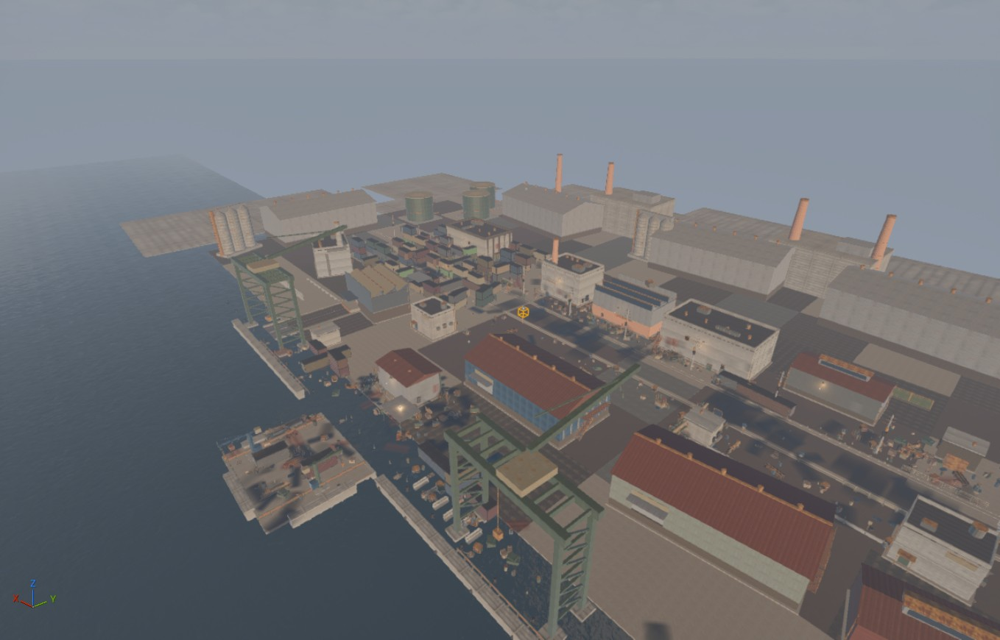</a></td>
<td width="12.5%"><a href="#2-umg-레이아웃-재현">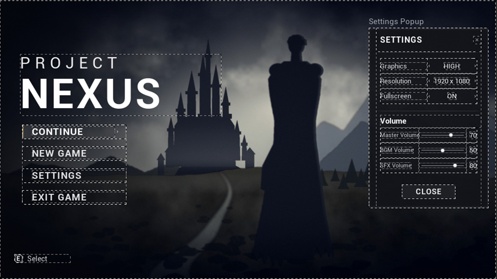</a></td>
<td width="12.5%"><a href="#3-캐릭터-리깅애니메이션">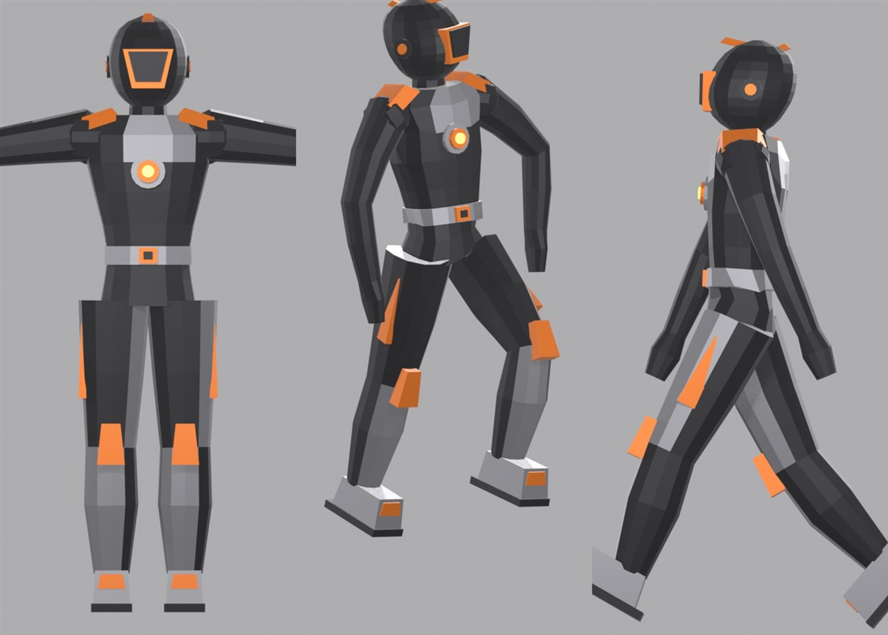</a></td>
<td width="12.5%"><a href="#4-나이아가라-vfx">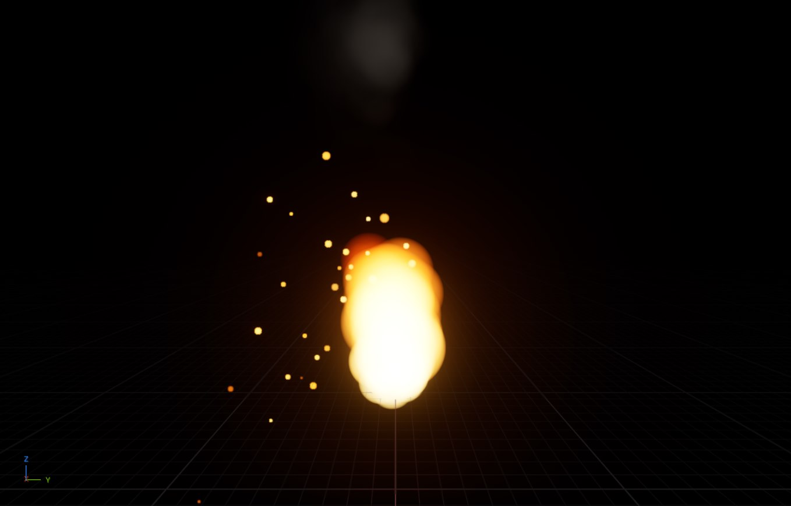</a></td>
<td width="12.5%"><a href="#5-pcg-절차적-숲">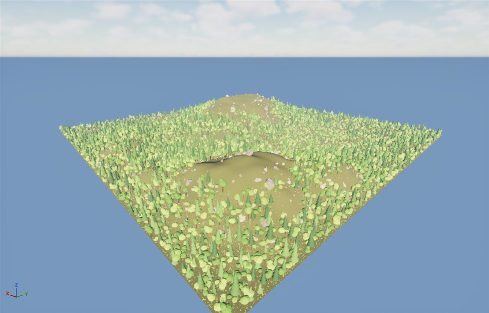</a></td>
<td width="12.5%"><a href="#6-시퀀서-시네마틱">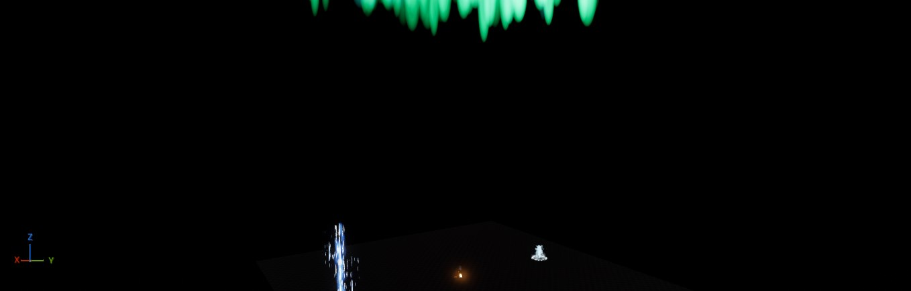</a></td>
<td width="12.5%"><a href="#7-control-rig-리깅">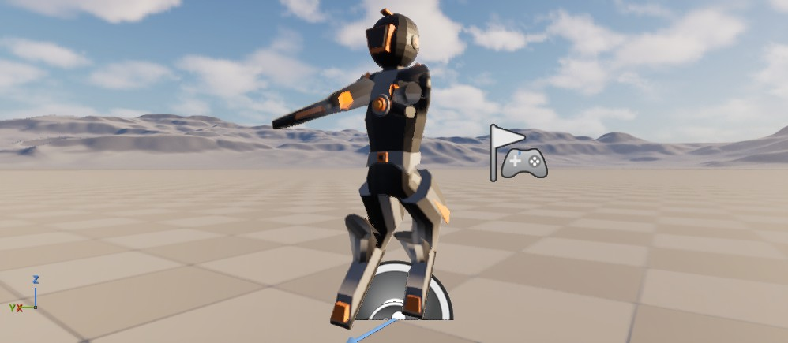</a></td>
<td width="12.5%"><a href="#8-블루프린트-게임플레이">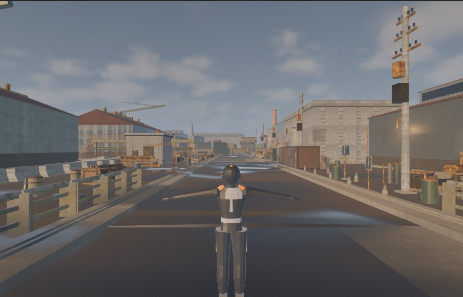</a></td>
</tr>
<tr>
<td align="center"><b>산업 항구 모듈러 킷</b><br>메시 90 · 액터 1,720</td>
<td align="center"><b>UMG 레이아웃 재현</b><br>WBP 8종 · 텍스처 15장</td>
<td align="center"><b>캐릭터 리깅·애니메이션</b><br>본 20 · 액션 2종</td>
<td align="center"><b>나이아가라 VFX</b><br>시스템 5종 · 에미터 23</td>
<td align="center"><b>PCG 절차적 숲</b><br>인스턴스 70,325</td>
<td align="center"><b>시퀀서 시네마틱</b><br>42초 · 6샷</td>
<td align="center"><b>Control Rig 리깅</b><br>컨트롤 28 · IK 4체인</td>
<td align="center"><b>블루프린트 게임플레이</b><br>BP 2종 · 노드 26</td>
</tr>
</table>

## 목차

커밋 순서(작업한 순서)대로 정렬했습니다.

| # | 작업 | 규모 | 폴더 | 커밋 |
|---|---|---|---|---|
| [1](#1-산업-항구-모듈러-킷) | **산업 항구 모듈러 킷** | 메시 90 / 텍스처 81 / 액터 1,720 | `Content/IndustrialHarbor_Claude` | `55d1fc5`…`ae3f916` |
| [2](#2-umg-레이아웃-재현) | **UMG 레이아웃 재현** | WBP 8종 / 텍스처 15장 / 기준 1920×1080 | `Content/UIReferenceTest` | `1300782` |
| [3](#3-캐릭터-리깅애니메이션) | **캐릭터 리깅·애니메이션** | 본 20 / 폴리 938 / 액션 2종 | `Content/Characters` | `aa65f26` |
| [4](#4-나이아가라-vfx) | **나이아가라 VFX** | 시스템 5종 / 에미터 23 / 머티리얼 3종 | `Content/VFX_Test` | `5064487` |
| [5](#5-pcg-절차적-숲) | **PCG 절차적 숲** | 그래프 93노드 / 인스턴스 70,325 / 지형 600m | `Content/PCG_Test` | `4cfc69f` |
| [6](#6-시퀀서-시네마틱) | **시퀀서 시네마틱** | 1260프레임 / 6샷 / 카메라 6대 | `Content/VFX_Test` | `1de62e4` |
| [7](#7-control-rig-리깅) | **Control Rig 리깅** | 컨트롤 28 / 그래프 53노드 / IK 4체인 | `Content/Characters` | `3d760bc` |
| [8](#8-블루프린트-게임플레이) | **블루프린트 게임플레이** | BP 2종 / 노드 26 / 입력 8종 | `Content/HarborGame` | `4b4d1ad` |

굵은 항목은 **결과 → 파이프라인 → 재현 방법 → 기술 노트** 순서로 상세 정리했습니다.
기술 노트에는 MCP로 막힌 지점과 우회책을 적어뒀습니다(접혀 있습니다).

---

# 1. 산업 항구 모듈러 킷

> `Content/IndustrialHarbor_Claude` · 소스 `ExternalAssets/{Models,Textures}/IndustrialHarbor_Claude`

완전히 버려진 폐허가 아니라 **20~30년 된 시설물이 지금도 돌아가는** 낡은 한국 항구·산업 지역. Blender MCP로 건물·모듈러·프롭·컨테이너를 절차적으로 만들어 FBX로 내보내고, Poly Haven CC0 텍스처를 입힌 뒤 마스터 머티리얼과 인스턴스 56개로 녹·때·색을 갈라 배치까지 전부 MCP로 진행했습니다. Landscape는 쓰지 않고 지면·부두까지 전부 Static Mesh로 구성했습니다.


## 1.1 결과

| 항목 | 값 |
|---|---|
| Blender 메시 → FBX | 90개 (건물 14 · 모듈러 41 · 프롭 31 · 컨테이너 4) |
| 텍스처 | 81장 (Poly Haven CC0 2K, 27세트 × BaseColor/Normal/ARM) |
| 머티리얼 | 마스터 3종(Industrial/Water/Decal) + 인스턴스 56개 |
| 레벨 액터 | 1,720개 (배치 1,371 · 데칼 305 · 대안 배경 18 · 라이팅 등) |
| 배치 건물 | 주요 16동(8종) + 배경 32동(6종) |
| 컨테이너 | 106개, 8색 variation, 1~3단 적재 |
| 메시 설정 | Nanite 활성 (지면 타일·유리·소형 프롭 일부 제외) |
| 언리얼 에셋 | 230 uasset |
| Landscape | 미사용 — 지면·도로·부두 전부 Static Mesh |

<table>
<tr>
<td width="50%">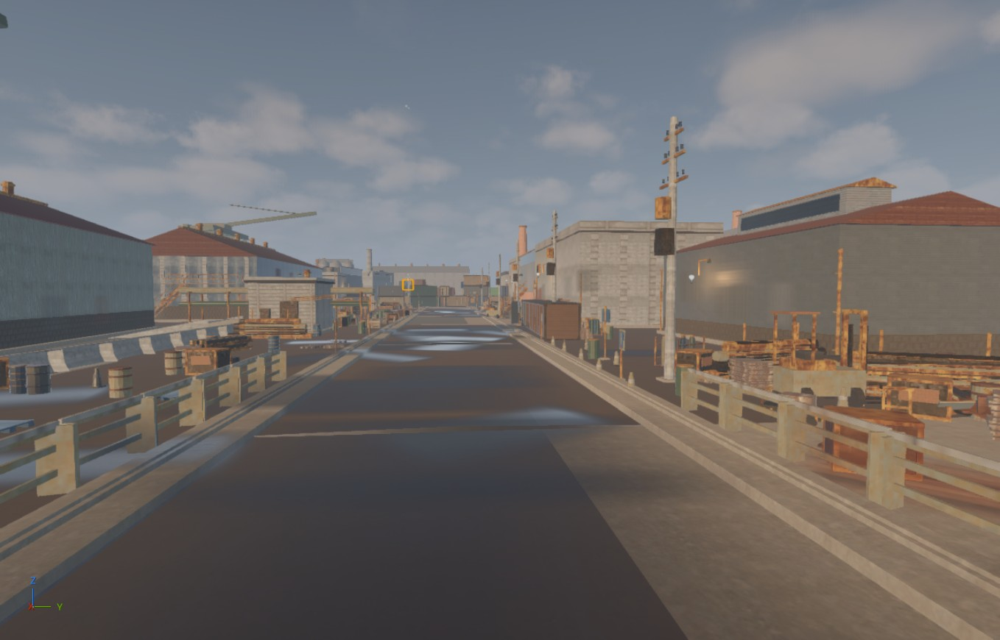</td>
<td width="50%">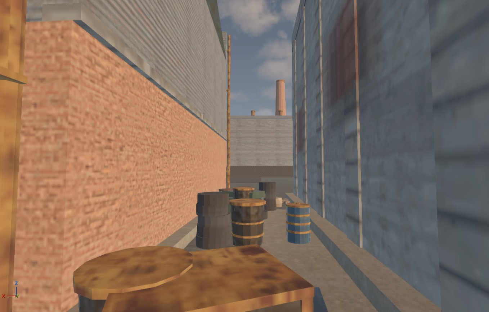</td>
</tr>
<tr>
<td align="center">Area A — 진입 도로 (전봇대·펜스·화물 대기 공간)</td>
<td align="center">Area B — 창고 사이 골목 (배관·전기함·조명 디테일)</td>
</tr>
<tr>
<td width="50%">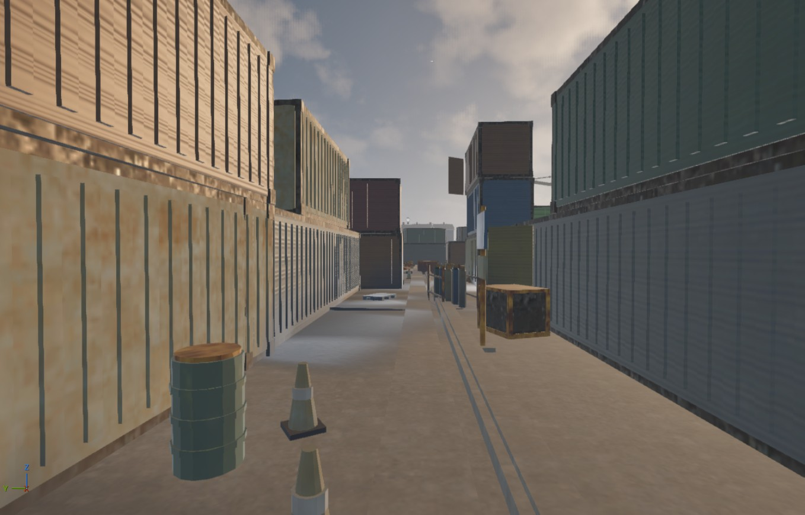</td>
<td width="50%">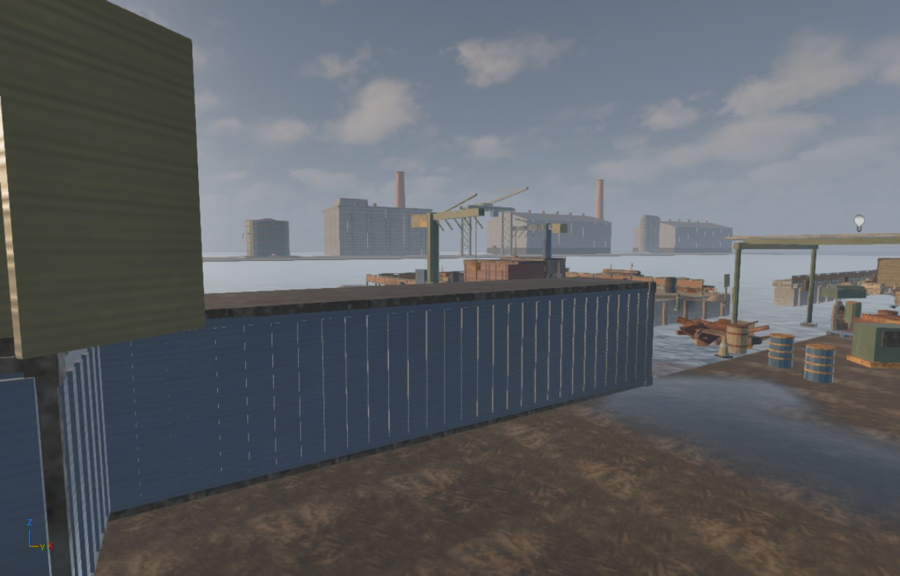</td>
</tr>
<tr>
<td align="center">Area C — 컨테이너 야적장 (1~3단 적재, 통행 가능한 협로)</td>
<td align="center">Area E — 부두 (갠트리 크레인·소형 크레인·바다)</td>
</tr>
</table>

## 1.2 파이프라인

```
Blender MCP (전용 Collection)
      │
      ├─ ① bmesh 프리미티브 조합       벽·지붕·배관·계단·컨테이너를 코드로 생성
      ├─ ② 면 법선 우세축 평면 UV      머티리얼별 m/타일 지정, 골강판은 리브가
      │                               수직이 되도록 UV 90° 회전
      └─ ③ 개별 FBX Export             Buildings / Modular / Props / Containers
            │
      Poly Haven CC0                  콘크리트·골강판·아스팔트·목재·벽돌 27세트
            │                         BaseColor / Normal(nor_dx) / ARM, 2K
      Unreal MCP
      ├─ ① 텍스처 임포트                맵 종류별 압축·색공간 설정
      ├─ ② Static Mesh 임포트           Nanite on/off 판단
      ├─ ③ M_CL_Industrial_Master       ARM 반전 캐비티로 Dirt/Rust 마스킹,
      │    (마스터 머티리얼)            ObjectPositionWS 해시로 인스턴스 색편차
      ├─ ④ Material Instance 56종       컨테이너 8색 등 표면별 분기
      ├─ ⑤ Programmatic 스크립트로      1,720개 배치 + 인스턴스별
      │    일괄 배치                    OverrideMaterials
      ├─ ⑥ Lighting / PostProcess       늦은 오후 + Lumen GI/Reflection
      └─ ⑦ CaptureViewport로 검증        6회 반복 수정 (그림자·색·배치)
```

## 1.3 공간 구성

일직선 도로 하나로 끝나지 않도록 5개 구역을 성격이 다르게 나누고 서로 잇습니다.

| 구역 | 구성 |
|---|---|
| A 진입 도로 | 철제 게이트·펜스, 전봇대 11개, 도로 표지, 화물 대기 공간 |
| B 창고 거리 | 도로 양쪽 창고·소규모 공장 밀집, 건물 사이 골목 2곳 |
| C 컨테이너 야적장 | 106개, 방향·단수 혼합, 통행 가능한 협로 |
| D 정비 공간 | 작업대·공구함·발전기·컴프레서·가스통 랙·폐자재 |
| E 부두 | 콘크리트 부두, 방파제, 계선주, 소형 크레인, 갠트리 크레인, 바다 |

## 1.4 반복감 제거

같은 메시를 그대로 복제한 티가 나지 않도록 세 겹으로 변주했습니다.

- **인스턴스 색편차** — 마스터 머티리얼에서 `ObjectPositionWS`를 해시해 `Frac`으로 의사난수를 뽑고 `ColorVariation`으로 곱합니다. 같은 `MI_CL_Concrete_Aged`를 쓴 벽 두 개가 위치만 다르면 색이 미세하게 갈립니다.
- **컨테이너 8색** — 중성 아연도금 텍스처(`container_side`) 위에 Blue/Red/Green/Gray/Orange/Yellow/Faded/Rust 틴트를 얹어, 같은 지오메트리라도 야적장이 알록달록하게 보입니다.
- **건물 재사용 시 표면 교체** — 예를 들어 `Warehouse_A`는 3곳에 배치되는데, 두 번째·세 번째는 벽체·셔터·콘크리트 인스턴스를 각각 `Warm`/`Cool` 계열로 바꿔 같은 건물이라는 티를 줄였습니다.
- **Transform Variation** — 프롭은 시드 고정 난수로 위치·yaw를 흩뿌리고, 컨테이너 적재는 간격·회전·단수를 모두 조금씩 어긋나게 잡았습니다.

## 1.5 재현

1. 콘텐츠 브라우저에서 `Content/IndustrialHarbor_Claude/Level/L_IndustrialHarbor_Claude` 열기
2. Landscape가 없어 별도 지형 로드 없이 바로 플레이 가능 (PlayerStart 배치됨)
3. 메시 소스를 고치려면 `ExternalAssets/Models/IndustrialHarbor_Claude/IndustrialHarbor_Claude.blend`를 Blender에서 열어 편집 후 재-Export (자동 재생성 스크립트는 저장소에 포함하지 않았습니다)
4. 텍스처는 `ExternalAssets/Textures/IndustrialHarbor_Claude/_manifest.json`에 Poly Haven ID와 출처가 남아 있어 동일 세트를 다시 받을 수 있습니다

## 1.6 기술 노트

<details>
<summary><b>MCP로 막힌 것들 — 5건 (펼치기)</b></summary>

**`ActorTools.get_components`는 Billboard/Arrow 스프라이트 컴포넌트까지 반환합니다.** 조명 액터에 `component_type` 없이 프로퍼티를 쓰면 실제 `PointLightComponent`가 아니라 에디터 전용 시각화 컴포넌트에 값이 들어가 조용히 무시됩니다.
→ **우회**: 항상 `/Script/Engine.PointLightComponent` 같은 구체 타입으로 필터링해서 가져옵니다.

**`ObjectTools.set_properties`의 값은 JSON *문자열*이어야 합니다.** 오브젝트를 그대로 넘기면 스키마 오류가 납니다. 액터별로 다른 머티리얼을 입히는 유일한 방법인 `StaticMeshComponent.OverrideMaterials` 배열도 이 경로로만 씁니다 — 컴포넌트 단위 머티리얼 오버라이드 전용 툴은 따로 없습니다.

**`ProgrammaticToolset` 스크립트는 중간에 실패해도 이미 실행된 호출의 부수효과가 남습니다.** 배치 스크립트 안에서 한 액터 생성이 예외를 던지면 `run()`의 리턴값이 에러 텍스트로 통째로 교체되는데, 그 전까지 만든 액터들은 이미 레벨에 들어가 있습니다. "실패"로 보고돼도 재실행 전에 `exists` 체크로 멱등성을 확보해야 중복 배치를 피할 수 있습니다.

**중복(`duplicate`)한 레벨 에셋은 저장 전엔 `load_level`이 안 됩니다.** "has unsaved changes" 에러가 가리키는 건 현재 열린 레벨이 아니라 **로드하려는 대상**이라, 새로 만든 레벨을 저장하지 않고 곧바로 전환하면 매번 이 에러가 났습니다.

**`Decal Material`의 `DecalBlendMode`는 `set_properties`로 설정되지 않습니다.** 시도하면 "could not be set" 오류가 나서, 기본값(`DBM_Translucent`)에 `BlendMode: BLEND_Translucent`만 지정하는 선으로 우회했습니다. 데칼 305개 전부 이 설정으로 충분히 동작합니다.

</details>

---

# 2. UMG 레이아웃 재현

> `Content/UIReferenceTest` · 소스 `ExternalAssets/UIReferenceTest`

**참조 UI 스크린샷 한 장**만 입력으로 주고, 거기서 좌표·크기·여백·색·알파를 역산해 `UMGToolSet`으로 위젯 트리를 다시 세웠습니다. 기능(클릭·설정 적용·Push/Pop)은 범위에서 빼고 레이아웃과 비주얼만 맞췄습니다.

<table>
<tr>
<td width="50%">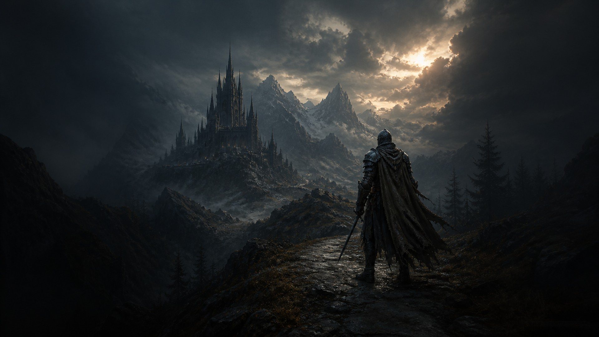</td>
<td width="50%"></td>
</tr>
<tr>
<td align="center"><b>입력</b> — 참조 UI 스크린샷 (이 한 장이 전부)</td>
<td align="center"><b>출력</b> — UMG 위젯 트리로 재구성</td>
</tr>
</table>

배경도 참조 이미지를 잘라 쓴 게 아니라 **같은 구도를 실루엣 페인팅으로 다시 그려 넣은 것**입니다(→ [2.3](#23-텍스처-자체-제작)).

*오른쪽 점선은 UMG 디자이너의 위젯 외곽선 표시입니다. 실제 렌더에는 나오지 않습니다.*

## 2.1 결과

| 항목 | 값 |
|---|---|
| 위젯 블루프린트 | 8종 (`CommonActivatableWidget` 2 · `CommonUserWidget` 4 · `UserWidget` 2) |
| 텍스처 | 15장 (전부 자체 생성) |
| 스타일 에셋 | `CommonButtonStyle` 1종 |
| 언리얼 에셋 | 25 uasset |
| 기준 해상도 | 1920×1080 (DPI 스케일 0.67에서 검증) |

<table>
<tr>
<td width="45%">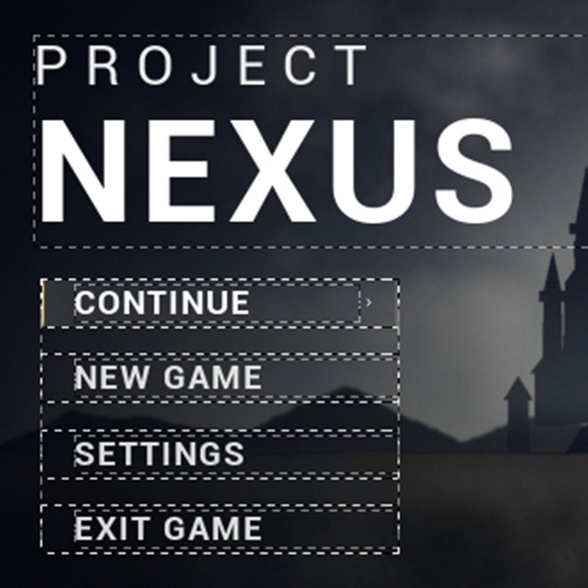</td>
<td width="55%">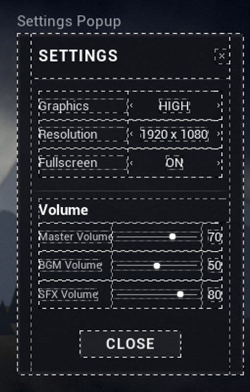</td>
</tr>
<tr>
<td align="center">타이틀 2단 + 메뉴 4항목 — 선택 항목만 금색 바·페이드 배경·테두리·chevron</td>
<td align="center">설정 팝업 465×700 — 옵션 3행 · 구분선 · 볼륨 3행 · CLOSE</td>
</tr>
</table>

## 2.2 위젯 계층

인스턴스마다 문구와 슬라이더 값이 다른 부분은 **`NamedSlot`으로 주입**해서, 같은 WBP를 텍스트 개수만큼 복제하지 않았습니다.

```
WBP_MainMenuScreen (CommonActivatableWidget)
└─ Overlay_Root
   ├─ Img_Background      T_UI_Background · Fill/Fill
   ├─ Img_LeftScrim       T_UI_LeftScrim · HAlign_Left 880px
   └─ Canvas_Content
      ├─ VBox_Title           @(78,208)   PROJECT 46 / NEXUS 120 Bold
      ├─ VBox_MainMenu        @(86,482)   405×311 · 항목 간격 29
      │  ├─ Btn_Continue      WBP_MenuButton_Selected → NamedSlot "CONTINUE"
      │  └─ Btn_NewGame / Btn_Settings / Btn_ExitGame  WBP_MenuButton
      ├─ Txt_PanelLabel       @(1429,64)  "Settings Popup"
      ├─ Panel_Settings       @(1429,107) 465×700
      └─ Prompt_Select        @(55,986)   WBP_KeyPrompt

WBP_SettingsPanel (CommonActivatableWidget)
└─ Root_SizeBox 465×700
   └─ Overlay_Panel
      ├─ Img_PanelFill    T_UI_White  #111318 α0.945
      ├─ Img_PanelNoise   T_UI_PanelNoise · Tiling Both · α0.05
      ├─ Img_PanelBorder  T_UI_Border · DrawAs Box · α0.18
      └─ VBox_Content     padding L28 / R29
         ├─ SizeBox_Header 94   Txt_Title + Btn_CloseIcon
         ├─ Img_Divider1
         ├─ Row_Graphics / Row_Resolution / Row_Fullscreen   WBP_OptionRow 59px
         ├─ Img_Divider2 · Txt_VolumeHeader
         ├─ Row_Master / Row_BGM / Row_SFX                   WBP_SliderRow 59px
         ├─ Spacer_Fill
         └─ Btn_Close                                        208×55 · 하단 37
```

메뉴 항목은 `WBP_MenuButton`(텍스트만)과 `WBP_MenuButton_Selected`(강조 4요소 포함) 두 종으로 나눴습니다. 하나로 두고 `Visibility`만 껐더니 **디자이너가 `Collapsed`를 무시하고 그려버려서**, 비선택 쪽은 아예 위젯을 삭제하는 편이 프리뷰와 런타임이 일치했습니다.

## 2.3 텍스처 자체 제작

프로젝트에 UI 소스가 없어 15장을 전부 Pillow/NumPy로 그려서 임포트했습니다. 생성기는 [`ExternalAssets/UIReferenceTest/gen_ui_textures.py`](ExternalAssets/UIReferenceTest/gen_ui_textures.py)에 있고, 다시 돌리면 같은 결과가 나옵니다(시드 고정).

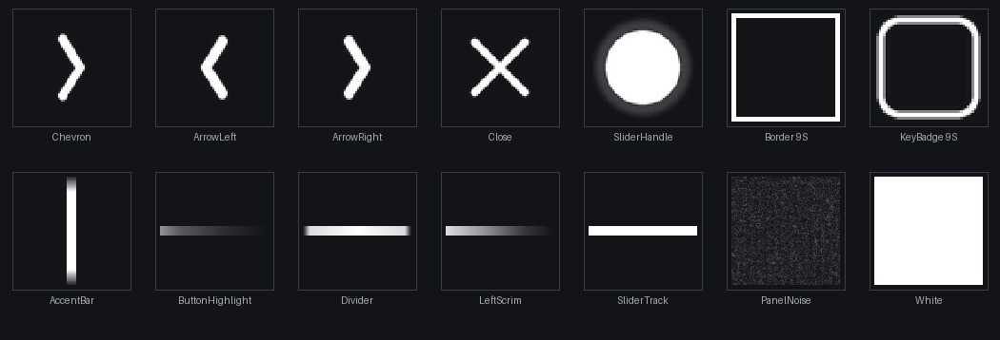

배경 `T_UI_Background`(1920×1080)는 참조 이미지를 복사한 것이 아니라 같은 구도를 **실루엣 페인팅으로 다시 그린 것**입니다.

```
하늘        고도 그라디언트 + 광원 3개 → fBm 구름 3레이어(어두운 상층 / 밝은 중층 / 수평 띠)
지형        노이즈 능선 폴리곤 3겹 · fBm 지면 셰이딩 · 대기 원근 + 거리 감쇠
실루엣      성(첨탑 9) · 망토 인물(폭 프로파일 11점 보간) · 침엽수 11 · 강 리본
후처리      비네트 · 좌측 스크림 · 스플릿 톤 · 필름 그레인
```

아이콘은 4배 슈퍼샘플 후 축소해 안티에일리어싱을 얻었고, 테두리류(`T_UI_Border`·`T_UI_KeyBadge`)는 9-slice로 만들어 `DrawAs: Box` + `Margin`으로 늘려 씁니다.

임포트 설정은 전부 `TEXTUREGROUP_UI` / `TMGS_NoMipmaps` / `NeverStream`, 아이콘·그라디언트는 알파 보존을 위해 `TC_EditorIcon`, 배경만 `TC_Default`입니다.

## 2.4 레이아웃 수치

참조 이미지에서 읽어낸 값을 1920×1080으로 환산해 그대로 넣었습니다.

| 요소 | 값 |
|---|---|
| 타이틀 | `PROJECT` 46 / 자간 400 · `NEXUS` 120 Bold / 자간 80 |
| 메뉴 버튼 | 405×56 · 피치 85 · 텍스트 좌패딩 38 · chevron 우패딩 26 |
| 강조 바 | 폭 3px `#F0C880` · 하이라이트는 좌→우 페이드 α0.26 |
| 설정 팝업 | 465×700 · 우측 여백 26 · 내부 패딩 divider 28 / 행 44 |
| 옵션 행 | 높이 59 · 값 영역 194 (`<` 값 `>` 중앙 정렬) |
| 볼륨 행 | 라벨 150 / 트랙 184 / 값 42 · 바 두께 2 α0.55 · 핸들 20px |
| 색 | 패널 `#111318` · 강조 `#F0C880` · 라벨 `#D8DADE` `#C6C9CE` · 보조 `#9EA2A8` |

색은 `set_properties`로 넣으면 **선형(linear) 값으로 그대로 저장**되므로, sRGB 표기를 매번 변환해서 기입했습니다.

## 2.5 재현

1. 콘텐츠 브라우저에서 `Content/UIReferenceTest/Widgets/WBP_MainMenuScreen` 열기
2. 디자이너 화면 크기를 16:9로 두면 참조와 동일한 배치
3. 텍스처를 다시 만들려면 `uv run --with pillow --with numpy python ExternalAssets/UIReferenceTest/gen_ui_textures.py`

## 2.6 기술 노트

<details>
<summary><b>MCP로 막힌 것들 — 4건 (펼치기)</b></summary>

**위젯 프로퍼티는 이름을 유추할 수 없습니다.** 클래스마다 다릅니다. `list_properties` → `get_properties` → `set_properties` 순서를 지키지 않으면 `set_properties`가 조용히 실패합니다. 중첩 구조체는 필드명까지 확인해야 합니다 — 브러시는 `resourceObject`/`imageSize`/`drawAs`/`margin`/`tintColor.specifiedColor`, 폰트는 `fontObject`/`typefaceFontName`/`size`/`letterSpacing`입니다.

**`CommonButtonBase`의 흰 배경을 끌 수 없었습니다.** 내부 `UButton`이 기본 스타일로 흰 사각형을 그리는데, `CommonButtonStyle` 서브클래스를 만들어 모든 브러시를 `NoDrawType`(그리고 알파 0)으로 비우고 `Style`에 CDO·인스턴스 양쪽으로 지정해도 그대로였습니다.
→ **우회**: 버튼 WBP 4종의 부모를 `CommonUserWidget`으로 리페어런트. 이번 작업은 클릭 기능이 범위 밖이라 손실이 없었습니다.

**디자이너는 `Visibility: Collapsed`를 무시합니다.** 편집 편의를 위해 `bHiddenInDesigner`를 대신 보기 때문에, 숨긴 자식이 프리뷰에 그대로 나옵니다. 프리뷰와 런타임을 일치시키려면 **숨기지 말고 지워야** 합니다.

**위젯을 스크린샷할 방법이 마땅치 않습니다.** `CaptureEditorImage`는 데스크톱 전체를 1280px로 줄여버려 UI 판독이 안 되고, `CaptureViewport`는 PIE 중에도 레벨 뷰포트만 잡습니다. 에디터 월드에 `WidgetComponent`를 놓는 우회로는 렌더 타깃이 갱신되지 않거나 검게 나왔습니다.
→ **우회**: 위젯 에디터 창을 Win32로 최상위에 올려 `CopyFromScreen`으로 원본 해상도 캡처. 디자이너 줌은 `PostMessage(WM_MOUSEWHEEL)`로만 움직였고(`mouse_event`는 먹지 않음), MCP로 에셋을 고쳐도 **프리뷰가 갱신되지 않아** 창을 닫았다 다시 열어야 했습니다.

</details>

---

# 3. 캐릭터 리깅·애니메이션

> `Content/Characters` · 소스 `Blender/SK_Character.blend` · `Export/SK_Character.fbx`

**참조 이미지 앞/뒤 2장**만 입력으로 주고, **Blender MCP로 메시 → 리그 → 애니메이션까지 전부 스크립트로 생성**한 뒤 언리얼 스켈레탈 메시로 넘겼습니다. 버텍스를 손으로 찍거나 웨이트를 칠한 곳은 없습니다.

<table>
<tr>
<td width="25%">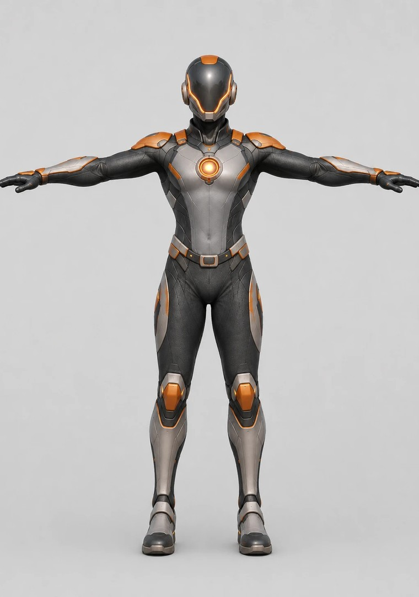</td>
<td width="25%">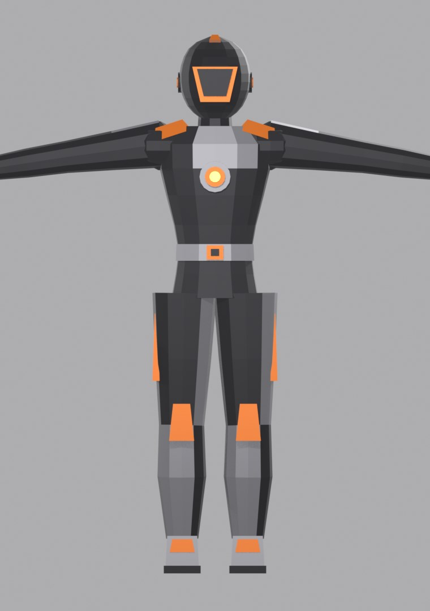</td>
<td width="25%">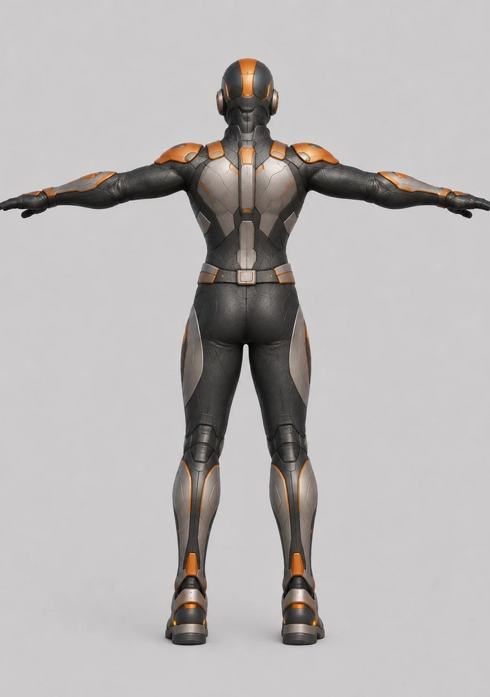</td>
<td width="25%">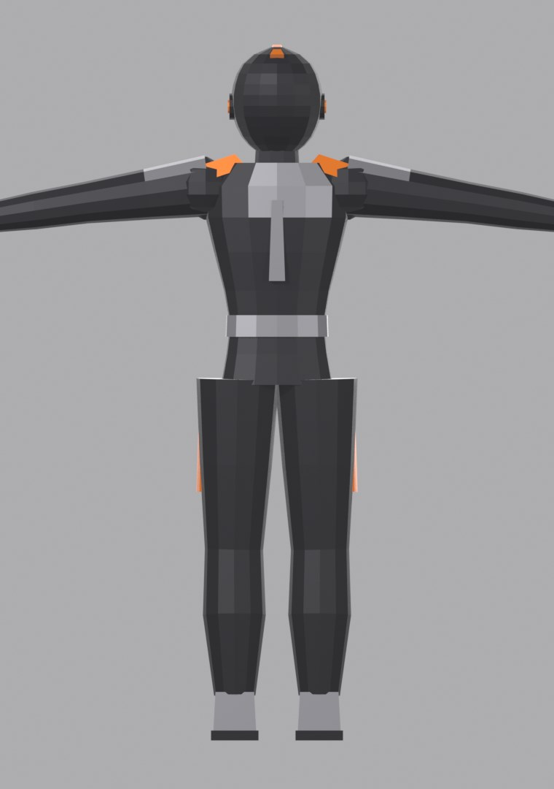</td>
</tr>
<tr>
<td align="center"><b>입력</b> — 참조 정면</td>
<td align="center"><b>출력</b> — 정면 (바이저 · 가슴 코어 · 벨트 버클)</td>
<td align="center"><b>입력</b> — 참조 후면</td>
<td align="center"><b>출력</b> — 후면 (정수리 스트립 · 등 척추 라인)</td>
</tr>
</table>

레퍼런스는 노멀맵·서브서피스까지 낸 실사풍 컨셉아트지만, 실제로 넘긴 정보는 **실루엣·프롭 배치·색 블로킹**뿐입니다. 헬멧 바이저, 가슴 코어, 벨트 버클, 어깨·팔꿈치·무릎 패드, 정강이 보강재, 부츠 — 이 배치를 superellipse loft(3.2)로 재해석하고, 텍스처 없이 4색 머티리얼(다크 / 실버 / 오렌지 / 이미시브)로 근사했습니다.

## 3.1 결과

| 항목 | 값 |
|---|---|
| 메시 | 1,172 verts / 938 polys (언리얼 5,192 verts / 4 섹션) |
| 키 | 180.8 cm (발바닥 z=0 정렬) |
| 본 | 20개 — `root` 최상위 |
| 머티리얼 | 4종 (다크 / 실버 / 오렌지 / 코어 이미시브) |
| `A_Character_Idle` | 60키 / 1.97초 / 30fps |
| `A_Character_Walk` | 24키 / 0.77초 / 30fps |
| 그 외 | Skeleton · PhysicsAsset 자동 생성 |

본 계층은 `root → pelvis → spine → chest → neck → head`, 여기서 `shoulder → upperarm → lowerarm → hand`와 `thigh → calf → foot`이 `_L`/`_R`로 갈라집니다.

## 3.2 파이프라인

메시는 프리미티브를 쌓는 대신 **단면 링을 이어 붙이는 loft**로 만들었습니다. 단면을 초타원(superellipse)으로 두면 지수 하나로 원↔사각을 오갈 수 있어, 같은 코드로 몸통(각진 단면)과 팔다리(둥근 단면)를 뽑습니다.

```
superellipse 링 loft                단면 12~16각, 밴드별 머티리얼 지정
      │
      ├─ ① 몸통·팔·다리            링 시퀀스 + 방향벡터 (팔다리는 축 기울기 반영)
      │    헬멧·코어·벨트·패드·부츠  박스 / 디스크 프리미티브
      │    face_mat(밴드, 세그먼트)   앞·뒤·바깥면 컬러 블로킹
      ├─ ② 아마추어 20본            rest 좌표를 메시 실측값에 맞춰 배치
      ├─ ③ 웨이트                   정점↔본 선분 거리 → 가중치 → 이웃 스무딩
      ├─ ④ 키포즈                   월드축 회전을 본 로컬 쿼터니언으로 변환
      ├─ ⑤ 접지 보정                프레임별 메시 최저점 측정 → pelvis 수직 이동
      └─ ⑥ FBX                      Apply Unit Scale / Bake All Actions / Leaf Bones OFF
```

## 3.3 리깅

자동 웨이트(Bone Heat)는 이 메시에서 **전 정점 웨이트 0**을 냅니다. 파츠가 서로 닫힌 셸이라 열확산 해가 없기 때문입니다. 그래서 정점에서 각 본 선분까지의 거리로 직접 계산했습니다.

```
w = 1 / (거리 + 0.015)^4.2       후보 = 최근접 본 + 그 부모/자식
                                 상위 4개, 임계값 0.02, 이웃 평균 스무딩 1회
```

후보를 최근접 본의 **부모·자식으로만 제한**하는 것이 핵심입니다. 이게 없으면 팔 정점이 가슴 웨이트를 받아 목을 돌릴 때 몸통이 딸려옵니다.

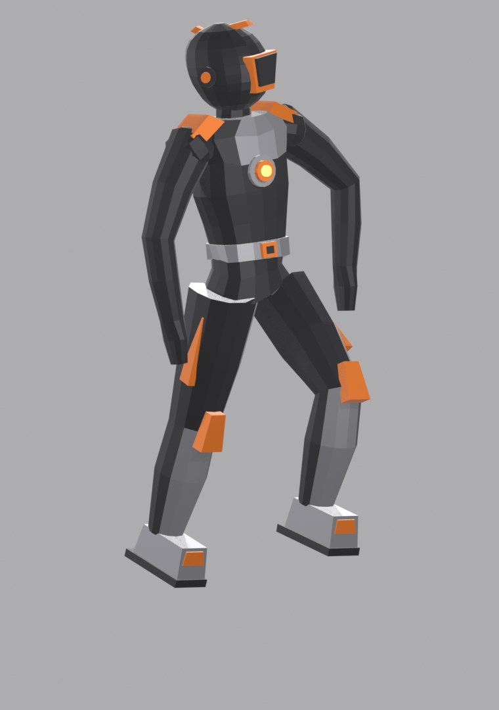

팔·다리·머리를 동시에 꺾어도 관절이 찢어지지 않고, 어깨 패드·무릎 패드·부츠 같은 별도 파츠도 정확히 따라옵니다.

## 3.4 애니메이션

<table>
<tr>
<td width="50%">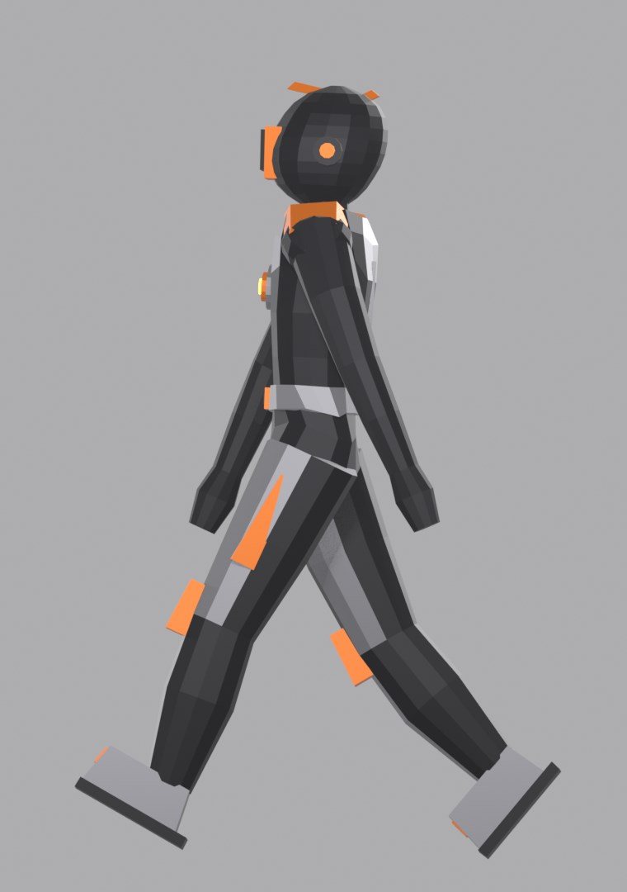</td>
<td width="50%">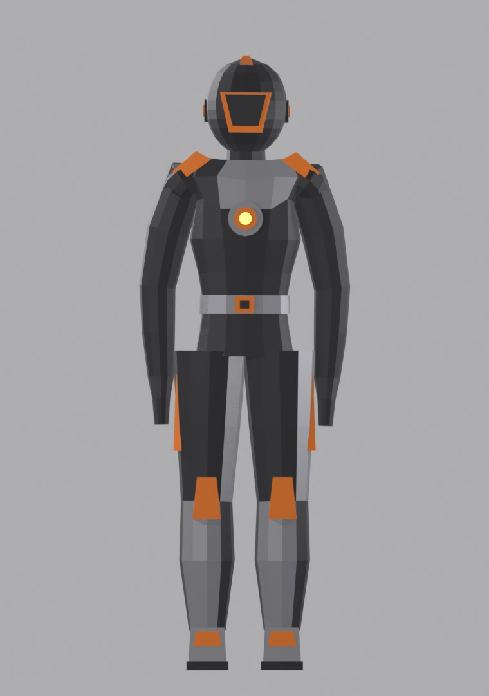</td>
</tr>
<tr>
<td align="center"><b>Walk</b> — 콘택트 포즈, 뒤꿈치 착지 + 뒷발 밀어내기</td>
<td align="center"><b>Idle</b> — 호흡 + 미세 좌우 흔들림</td>
</tr>
</table>

**Walk** — 24프레임 4키 사이클(contact → down → passing → up)을 반주기만 정의하고 나머지 절반은 좌우 미러로 생성합니다. 팔은 반대쪽 다리와 반대 위상, 골반은 좌우 롤 + 상체 요를 함께 겁니다.

**접지 보정** — 다리를 27° 벌리면 다리 길이가 유지되는 만큼 발이 9cm 뜹니다. 키포즈마다 메시 최저점을 실측해 `pelvis`를 `-min_z`만큼 내리면, 평행이동이라 **1회 보정으로 정확히 수렴**합니다. 키프레임에서 오차 0, 보간 구간 최대 8mm. 이 보정이 골반 상하 바운스(-2.3 ~ +3.1cm)도 자동으로 만들어줍니다.

**Idle** — 60프레임, `chest` 피치로 호흡을 만들고 골반은 수직으로 움직이지 않습니다(발이 뜨지 않게). 위상을 `2π(f-1)/59`로 두어 60프레임이 1프레임과 같아집니다.

## 3.5 언리얼 임포트

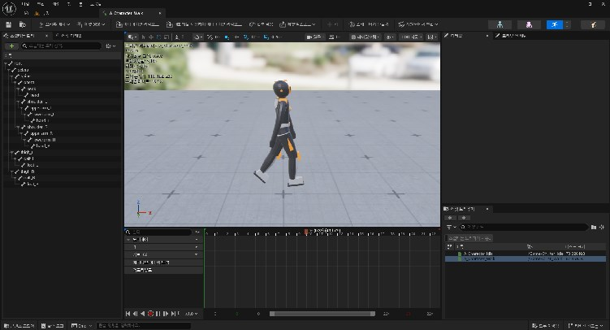

`SkeletalMeshTools.import_file` 한 번으로 SkeletalMesh · Skeleton · PhysicsAsset · AnimSequence 2종 · Material 4종이 생성됩니다. 검증 결과 임포트 경고 0건, 바운드 180.9cm, 정면 +X.

## 3.6 재현

1. 콘텐츠 브라우저에서 `Content/Characters/SK_Character` 열기
2. `A_Character_Walk` / `A_Character_Idle` 더블클릭해 재생
3. 소스를 고치려면 `Blender/SK_Character.blend` → 익스포트 설정은 아래 기술 노트 참고

## 3.7 기술 노트

<details>
<summary><b>MCP로 막힌 것들 — 5건 (펼치기)</b></summary>

**자동 웨이트가 실패합니다.** 파츠를 여러 개의 닫힌 셸로 만들어 join한 메시는 `parent_set(type='ARMATURE_AUTO')`가 "뼈대 히트 웨이팅: 솔루션을 찾지 못 함" 경고와 함께 **전 정점 웨이트 0**을 만듭니다. 버텍스 그룹은 19개 생기는데 값이 전부 비어 있어서, 웨이트가 없다는 걸 눈으로는 못 알아챕니다.
→ **우회**: 거리 기반 수동 웨이트(3.3). 로우폴리에서는 결과가 오히려 예측 가능합니다.

**Blender 좌표가 언리얼에 그대로 갑니다.** `axis_forward='-Z', axis_up='Y'`(기본값)로 내보내면 Blender `(x,y,z)` → 언리얼 `(x,y,z)` 항등 매핑입니다. 언리얼 표준은 +X 정면이므로 **Blender에서 +X를 정면으로 모델링해야** 합니다. +Y 정면으로 만들었다가 90° 틀어진 걸 뒤늦게 발견했습니다(바운드의 `boxExtent.x`가 팔 span으로 잡히면 틀어진 겁니다).
→ **우회**: 메시 정점과 본 rest 좌표를 `(x,y,z) → (y,-x,z)`로 변환. Blender 오른손계 ↔ 언리얼 왼손계 차이 덕에 `_L`/`_R` 라벨도 자동으로 맞습니다. 단 **rest를 돌리면 본 로컬 축이 바뀌어 기존 키가 깨지므로 애니메이션은 재생성**해야 합니다(접지 오차가 8mm → 36mm로 튀는 걸로 드러납니다).

**아마추어 오브젝트 이름이 언리얼 최상위 본이 됩니다.** `armature_nodetype='NULL'`로 둬도 마찬가지입니다. 아마추어 안에 `root` 본을 따로 만들면 `ARM_Character → root → pelvis`로 한 단계 밀립니다.
→ **우회**: 아마추어 **오브젝트** 이름을 `root`로 하고 안쪽 `root` 본은 삭제. 부작용으로 액션 이름이 `SK_X_Anim_root_Idle`이 되므로 임포트 후 `AssetTools.move`로 리네임합니다.

**Blender 5.x 액션에는 `fcurves`가 없습니다.** 슬롯/레이어 구조로 바뀌어 `action.layers[].strips[].channelbags[].fcurves`로 내려가야 합니다. 액션을 붙일 때도 `animation_data.action = act` 다음에 `act.slots.new(id_type='OBJECT', …)` → `animation_data.action_slot = act.slots[0]`까지 해줘야 키가 들어갑니다.

**월드축 회전을 본 로컬로 옮길 때 부모 행렬을 끼우면 안 됩니다.** `bone.matrix_local`은 이미 아마추어 공간 기준이라 `Quaternion(matrix_local.to_3x3().inverted() @ world_axis, angle)`이면 끝입니다. 부모를 한 번 더 곱했더니 다리는 우연히 맞고 팔만 전혀 안 도는 증상이 나왔습니다. 회전을 여러 개 합성할 때는 **나중에 적용할 것을 왼쪽에** 곱합니다(팔을 내린 뒤 앞뒤로 스윙하려면 `q_swing @ q_down`).

**그 외** — 절차적 생성 메시는 UV가 없어 임포트 시 "UV 세트 없음" 경고가 뜹니다. `bpy.ops.uv.smart_project()` 한 줄로 해결됩니다. 그리고 `CaptureAssetImage`/`CaptureEditorImage`는 base64가 커서 응답이 잘리므로, 저장된 tool-results 파일에서 디코드해 PNG로 봐야 합니다.

</details>

---

# 4. 나이아가라 VFX

> `Content/VFX_Test`

나이아가라 시스템 5종을 에디터 UI 없이 만들었습니다. **에미터 23개, 스택 에러 0, 전 시스템 컴파일 UpToDate.** 색·크기 그라데이션은 커브를 쓰지 않고 **HLSL 표현식으로 생성**했습니다 — 커브 DataInterface에 값을 쓰면 에디터가 죽기 때문입니다.

<table>
<tr>
<td width="50%"></td>
<td width="50%">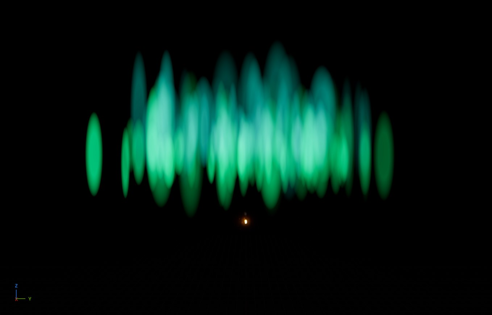</td>
</tr>
<tr>
<td><b>NS_Fire</b> — 흰노랑→주황→적색 HDR 램프, 불티, 라이트 렌더러</td>
<td><b>NS_Aurora</b> — 세로 시트 커튼 3겹, 녹색→청록→보라</td>
</tr>
<tr>
<td>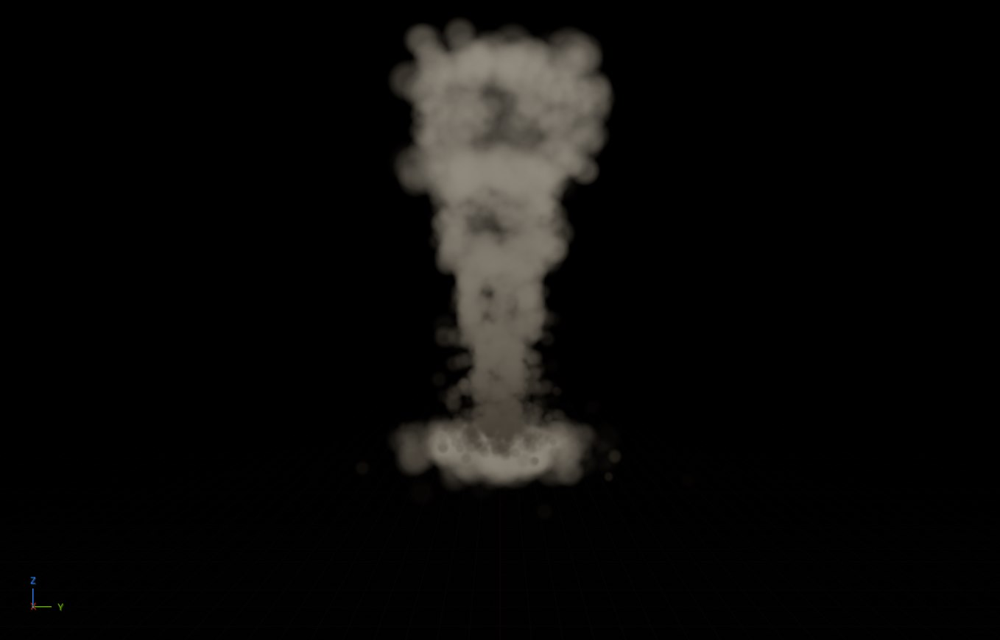</td>
<td>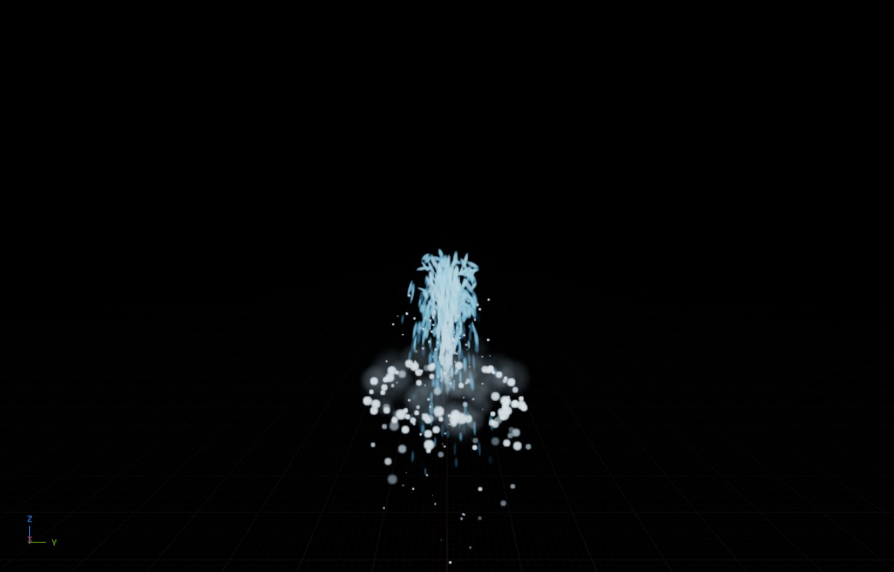</td>
</tr>
<tr>
<td><b>NS_Tornado</b> — 반경이 커지는 원통 밴드 5겹 + VortexForce</td>
<td><b>NS_WaterFountain</b> — Velocity-aligned 물줄기, 중력 포물선</td>
</tr>
<tr>
<td>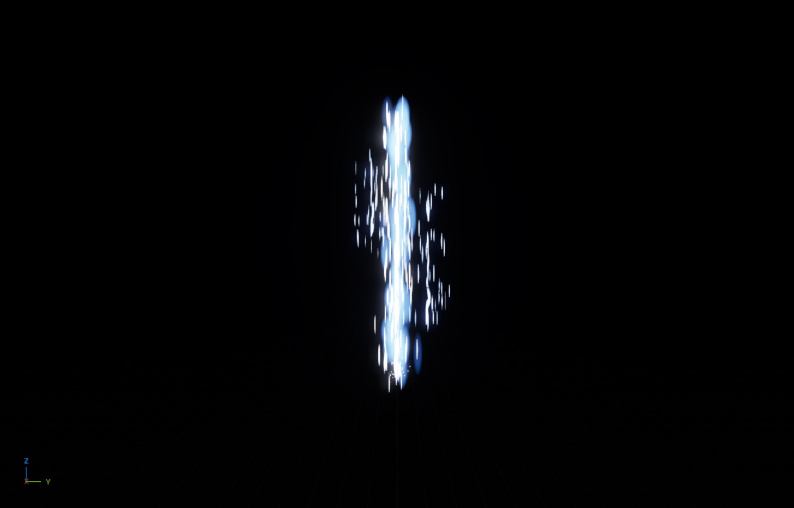</td>
<td></td>
</tr>
<tr>
<td><b>NS_Lightning</b> — HDR 볼트 + JitterPosition 지그재그, 2.4초 주기 플래시</td>
<td></td>
</tr>
</table>

## 4.1 결과

| 시스템 | 에미터 | 구성 | 핵심 기법 |
|---|---:|---|---|
| NS_Fire | 4 | Core / Embers / Smoke / **Light** | Curl Noise, HDR 램프, 라이트 렌더러 |
| NS_Aurora | 3 | Lower / Mid / Upper | 세로 non-uniform 스프라이트, 초저속 드리프트 |
| NS_Tornado | 7 | Band0–4 / GroundDust / **Debris(Mesh)** | VortexForce, 높이별 반경 확장 |
| NS_WaterFountain | 4 | Jet / Droplets / Mist / Splash | VelocityAligned 스트레치, 중력 −980 |
| NS_Lightning | 5 | MainBolt / Glow / Branch×2 / Sparks | JitterPosition, 시간 게이트 플래시 |
| **합계** | **23** | | |

머티리얼 3종(`M_VFX_Translucent` / `TranslucentRibbon` / `Additive`)은 엔진 기본 나이아가라 머티리얼을 복제해 블렌드 모드만 바꿔 만들었습니다.

## 4.2 파이프라인

모든 스프라이트 에미터가 `Fountain` 템플릿에서 출발해 같은 뼈대를 공유합니다.

```
CreateNiagaraSystem (MinimalLightweight)   시스템 생성 → 템플릿 에미터 제거
      │
      ├─ AddEmitter (Fountain / UpwardMeshBurst)
      │
      ├─ EmitterUpdate   SpawnRate
      ├─ ParticleSpawn   InitializeParticle  수명·크기·색 모드
      │                  ShapeLocation       Cylinder / Cone 분포
      │                  AddVelocity         원뿔 방향 + 속도 범위
      ├─ ParticleUpdate  GravityForce / Drag
      │                  CurlNoiseForce      난류
      │                  VortexForce         회전 (토네이도)
      │                  JitterPosition      각진 변위 (번개)
      │                  ScaleColor          ← HLSL 램프 (RGB·Alpha)
      │                  ScaleSpriteSize     ← HLSL 램프
      │                  SolveForcesAndVelocity
      └─ SetRendererData  머티리얼 / 정렬 / 정렬힌트
                          └ ApplyStackIssueFix 로 솔버 순서 자동 교정
```

`ScaleColor`의 `Scale RGB`·`Scale Alpha`에 중첩 `lerp` 문자열을 넣어 다단 그라데이션을 만듭니다. 불꽃 코어는 이렇게 펼쳐집니다.

```hlsl
lerp(lerp(lerp(float3(12,7,2), float3(8,3.2,0.5),
     saturate((Particles.NormalizedAge - 0.0) * 6.667)),
     float3(3.5,0.9,0.08), saturate((Particles.NormalizedAge - 0.15) * 4.0)), ...)
```

`Particles.NormalizedAge`, `Particles.Position`, `Engine.Time`을 참조할 수 있어 커브보다 표현력이 넓습니다.

## 4.3 재현

1. `Content/VFX_Test/L_VFX_Showcase` 열기
2. 레벨의 `FX_Showcase_*` 액터에서 개별 확인
3. 파티클이 안 보이면 **Simulate**를 켜세요 (에디터 뷰포트는 나이아가라를 tick하지 않습니다)

## 4.4 기술 노트

<details>
<summary><b>MCP로 막힌 것들 — 4건 (펼치기)</b></summary>

**커브 DataInterface에 쓰면 에디터가 크래시합니다.** `ScaleColor.Linear Color Curve` 같은 커브 입력에 `SetStackInputData`를 하면 `PlaceholderDataInterfaceChanged → ResetSystem`이 컴파일 중에 재진입해 `InitDITickLists`에서 널 참조로 죽습니다.
→ **우회**: HLSL 표현식 입력(`NiagaraExt_StackInputData_HlslExpression`)으로 전량 대체. 크래시가 없을 뿐 아니라 표현력도 더 좋습니다.

**`ShapeLocation`의 Box/Plane 셰이프는 파티클이 나오지 않습니다.** Cylinder·Cone은 정상입니다. 오로라가 렌더되지 않던 원인이었고, 원통 분포로 바꾸자 즉시 해결됐습니다. 원뿔은 파티클이 넓은 끝에 몰리므로, 테이퍼 실루엣은 **반경이 커지는 원통 밴드를 쌓는 편**이 예측 가능합니다(토네이도가 그 방식).

**빔(DynamicBeam) 리본은 신뢰할 수 없습니다.** `Use Beam Tangents`의 기본 탄젠트가 0이라 빔이 통째로 붕괴하고, 고쳐도 상대좌표 Start/End가 지정한 길이보다 훨씬 짧게 그려집니다. 오로라·번개 모두 스프라이트 방식으로 선회했습니다.

**그 외 자잘한 것** — `SetEmitterData`는 `bEnabled`가 아니라 **`bIsEnabled`**, 렌더러 프로퍼티는 PascalCase(camelCase는 에러 없이 무시), 스태틱 스위치로 숨겨진 입력은 부모 스위치를 바꿔도 **다음 호출에서 즉시 반영되지 않습니다**.

</details>

---

# 5. PCG 절차적 숲

> `Content/PCG_Test`

규칙만 주면 나무·바위·관목·풀이 알아서 자라는 PCG 그래프. 나무를 한 그루도 손으로 심지 않았고, **지형을 400m에서 600m로 교체했을 때 70,325개가 자동으로 재배치**됐습니다.


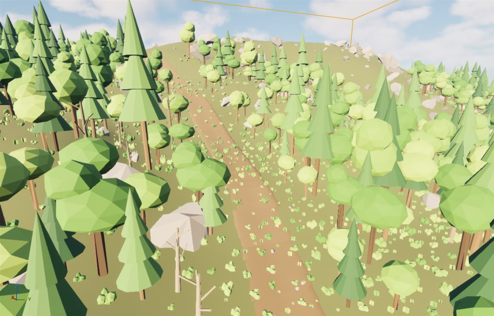

## 5.1 결과

| 레이어 | 메시 | 인스턴스 | 규칙 |
|---|---|---:|---|
| L1 대형 침엽수 | Pine A/B | 2,216 | 고도 1825–6290, 경사 ≤25°, 북사면 선호 |
| L2 중형 활엽수 | Broad A/B, Dead | 5,171 | 고도 100–6290, 경사 ≤30°, 남사면 선호 |
| L3 관목 | Bush A | 25,095 | 활엽수 근접 시에만 (Distance 가중) |
| L4 바위 | Rock A/B/C | 1,386 | 경사 반전 — 급경사일수록 밀집 |
| L5 풀 | Grass A | 31,617 | 고도 ≤5670, 경사 ≤20°, 겹침 허용 |
| L6 저지대 관목 | Bush A | 4,434 | 고도 ≤1690 전담, 밀도 2배 |
| 길 + 자갈 | Road_Segment, Rock A | 406 | 스플라인 추종, 폭 900 내 나무·바위 제거 |
| **합계** | | **70,325** | |

- 그래프 **93 노드 / 101 에지 / 7 브랜치**
- 지형 600m × 600m, 고도 100–9096 유닛
- 서브그래프 `PCG_ScatterLayer` (파라미터 6종) + 재사용 데모 `PCG_BiomeDemo`

## 5.2 파이프라인

모든 브랜치가 같은 6단계 뼈대를 공유하고 숫자만 다릅니다.

```
World Ray Hit Query          지형 표면 획득
      │
      ├─ ① Surface Sampler          격자 후보 포인트
      ├─ ② Normal To Density        경사 → 밀도
      │    Normal To Density        사면 방위(남/북) → 밀도 배수
      │    Spatial Noise (FBM)      펄린 노이즈 → 밀도 (숲 뭉침·빈터)
      │    Filter by Range          고도 컷 (설선 / 저지대)
      │    Distance                 나무까지 거리 → 밀도 (관목 전용)
      ├─ ③ Density Filter           임계값 미만 제거
      │    Self Pruning             최소 간격 이내 제거
      ├─ ④ Transform Points         랜덤 Yaw/스케일/지터 + Z 높이 변조
      ├─ ⑤ Projection               지형 표면에 스냅
      └─ ⑥ Static Mesh Spawner      ISM 인스턴스 생성
                                     └ Difference 로 길 위 제거
```

`$Density`가 기축통화입니다. ②에서 규칙을 밀도에 누적하고 ③에서 실행합니다.

## 5.3 생태 규칙

**설선** — 고도 상한을 넘으면 나무가 사라지고 바위만 남습니다.

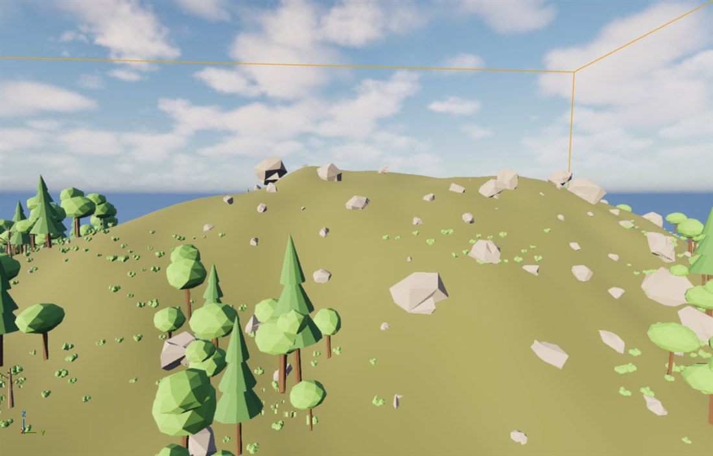

**경사 편중 + 근접 밀집** — 왼쪽 완경사는 숲, 오른쪽 급사면은 나무 없이 바위. 관목은 나무 주변에만 붙습니다.

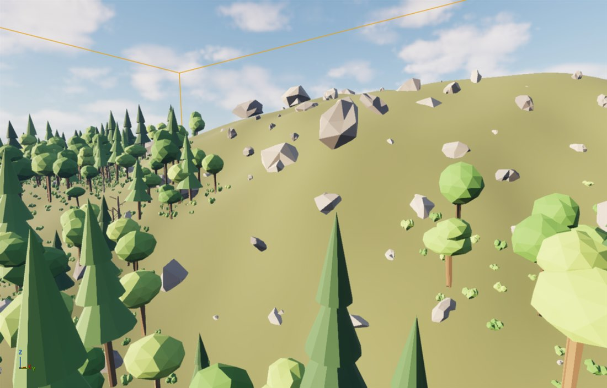

**길** — 스플라인을 지형에 투영해 세그먼트 메시를 이어 붙이고, `Difference`로 폭 900 내 나무·바위를 제거합니다. 가장자리엔 풀·관목·자갈이 남습니다.

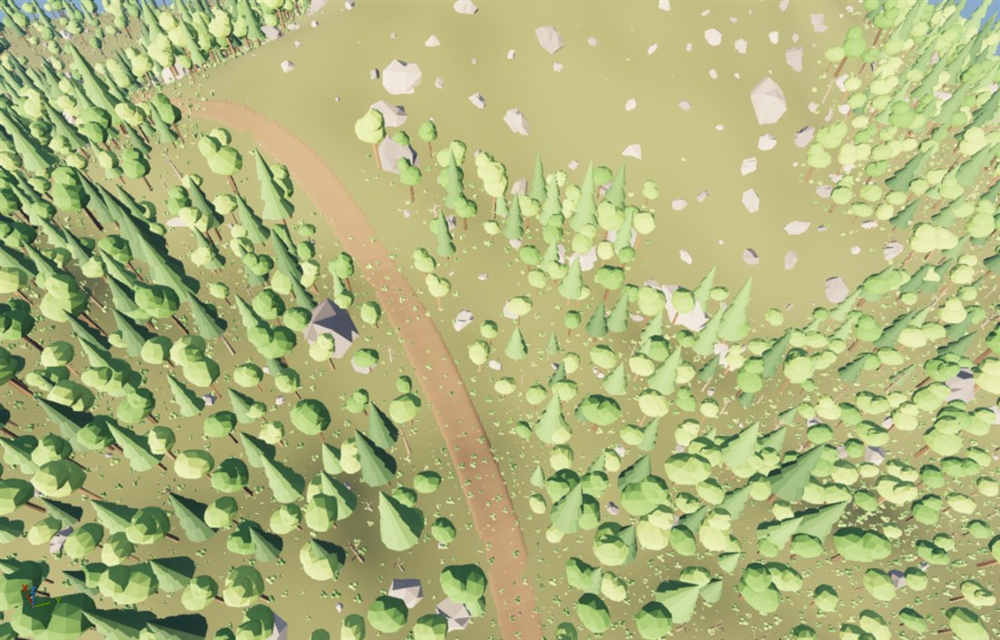

**개체 변화** — 같은 메시에 색조가 다른 MaterialInstance를 물려 침엽수 3톤 / 활엽수 3톤으로 갈립니다. Z축만 0.75–1.38배 흔들어 키도 다릅니다.

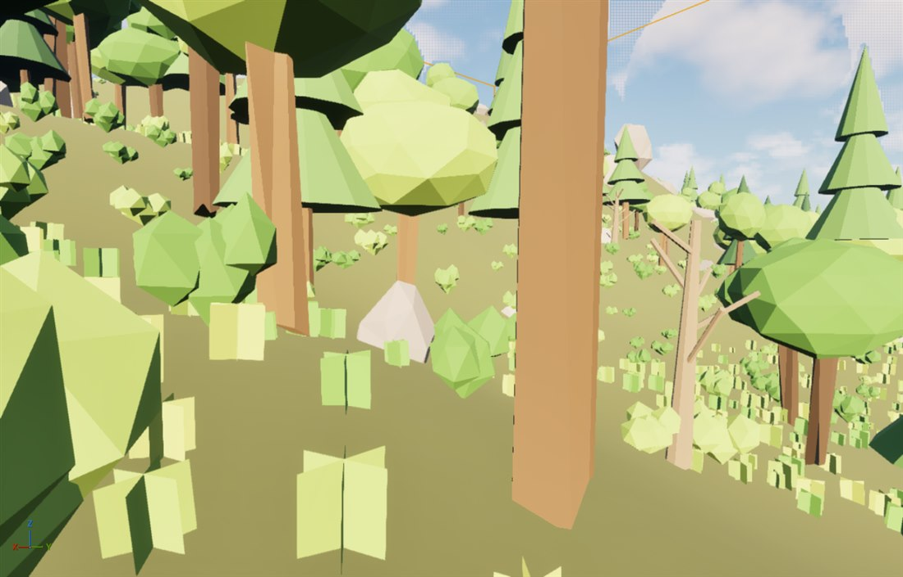

## 5.4 에셋 (Blender MCP 제작)

전부 로우폴리로 스크립트 생성 → FBX → 임포트했습니다. 원본 FBX는 `ImportSource/`에 있습니다.

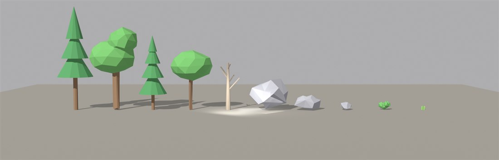

| 에셋 | 트라이앵글 | 높이 |
|---|---:|---|
| Tree_Pine_A / B | 116 / 94 | 10.1m / 14m |
| Tree_Broad_A / B | 108 / 188 | 8.1m / 11.2m |
| Tree_Dead | 128 | 6.4m |
| Rock_A / B / C | 44 each | 1.1 / 2.0 / 4.2m |
| Bush_A / Grass_A | 80 / 6 | 1.3m / 0.5m |
| Terrain_Forest | 80,802 | 600m, 기복 90m |
| Road_Segment | 40 | 폭 9.2m |

원점은 전부 밑동 바닥 중앙, +Z 업, 트랜스폼 적용 완료 (미터 단위 모델링 → 언리얼에서 1m = 100유닛 정확히 일치).

**접지 검증** — Projection이 정상 동작해 밑동이 뜨거나 묻히지 않습니다.

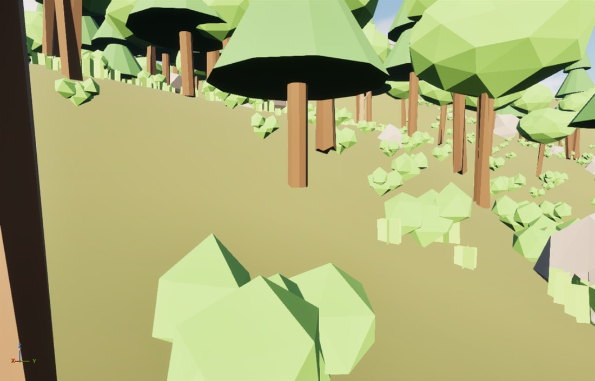

## 5.5 재현

1. `Content/PCG_Test/L_PCG_Forest` 열기
2. 아웃라이너에서 `PCG_ForestVolume` 선택
3. Details → PCG Component → **Generate**

파라미터를 바꾸려면 `PCG_ForestGraph`에서 각 브랜치의 `Surface Sampler`(밀도), `Density Filter`(임계값), `Filter by Range`(고도)를 조정합니다. 개수 확인은 노드 우클릭 → **Inspect**.

## 5.6 기술 노트

<details>
<summary><b>MCP로 막힌 것들 — 5건 (펼치기)</b></summary>

**랜드스케이프를 PCG로 샘플링할 수 없습니다.** `Get Landscape Data`가 항상 빈 결과를 냅니다. 원인은 `PCGWorldActor.LandscapeCache`의 `cacheEntryCount`가 0인 것인데, 이 캐시를 빌드하는 경로가 MCP에 없습니다(콘솔 *명령* 실행 툴도 없어 우회 불가). `serializationMode` 변경, 랜드스케이프 더티 마킹, `Wait Until Landscape Is Ready` 삽입 모두 실패했습니다.
→ **우회**: 지형 메시를 `CTF_UseComplexAsSimple` 콜리전으로 두고 `World Ray Hit Query`로 표면을 얻습니다. 노멀도 정상이라 경사 규칙이 전부 동작합니다.

**`Spawn Spline Mesh`는 사용 불가.** 그래프에 넣으면 `ExecuteGraphInstance`가 실패하고, 노드를 지워도 볼륨이 망가진 채 남습니다(볼륨 재스폰으로만 복구). 길은 Static Mesh Spawner로 세그먼트를 이어 붙여 만들었습니다.

**인스턴스별 랜덤 색은 머티리얼 표현식으로 안 됩니다.** `PerInstanceRandom`, `PerInstanceCustomData` 모두 PCG가 만든 ISM에서 값을 못 받습니다(PCG 쪽 어트리뷰트 생성은 정상 확인). descriptor에 `numCustomDataFloats`가 노출되지 않는 것이 원인으로 보입니다.
→ **우회**: `MeshEntries` descriptor의 `OverrideMaterials`로 같은 메시에 색만 다른 MIC를 물립니다.

**그래프 파라미터 → 노드 바인딩은 됩니다.** `Get Graph Parameter` 노드를 만들고 `ConnectNodePins`의 대상 핀 라벨에 **노드 프로퍼티 이름을 그대로** 주면 오버라이드 핀에 연결됩니다(`GetSlopeCos.Out → SlopeCut.LowerBound`). 단 중첩 구조체 프로퍼티(고도 필터의 threshold 등)는 오버라이드 핀이 없어 파라미터화가 안 됩니다.

**튜닝은 실측 분포로.** Density Filter 임계값을 감으로 잡으면 안 됩니다. 노이즈 출력이 0.51–1.0 범위인데 임계값 0.55를 주면 아무것도 안 걸러집니다. `GetNodeDataView`(에디터의 Inspect)로 실제 분포를 읽어 목표 개수의 백분위에서 역산해야 합니다. 그리고 **Self Pruning이 개수의 천장**이라, 샘플을 늘려도 안 늘면 `pointExtents`(= 최소간격 ÷ 2)를 줄이는 것이 유일한 손잡이입니다.

</details>

---

# 6. 시퀀서 시네마틱

> `Content/VFX_Test`

VFX 5종을 훑는 **42초(1260프레임 @ 30fps) 6샷** 시퀀스 `LS_VFX_Showcase`. 샷마다 스포너블 시네카메라를 하나씩 두고 트랜스폼과 **초점거리를 함께 키프레임**했습니다.


## 6.1 샷 구성

| # | 대상 | 구간 | 카메라 워크 | 렌즈 |
|---|---|---|---|---|
| 1 | 오로라 | 0–8s | 좌→우 수평 트래킹 | 16.5mm |
| 2 | 토네이도 | 8–16s | 로우앵글 크레인 업 + 오빗 | 23.5 → 30mm |
| 3 | 번개 | 16–23s | 정지에 가까운 푸시인 | 25.7 → 32.5mm |
| 4 | 분수 | 23–31s | 시계방향 오빗 | 28.3 → 34.6mm |
| 5 | 불 | 31–38s | 클로즈업 회전 | 43.5 → 55.4mm |
| 6 | 풀백 | 38–42s | 상공으로 후퇴, 전체 조망 | 34.6 → 16.5mm |

<table>
<tr>
<td width="50%">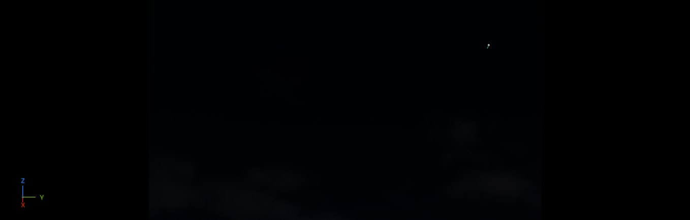</td>
<td width="50%">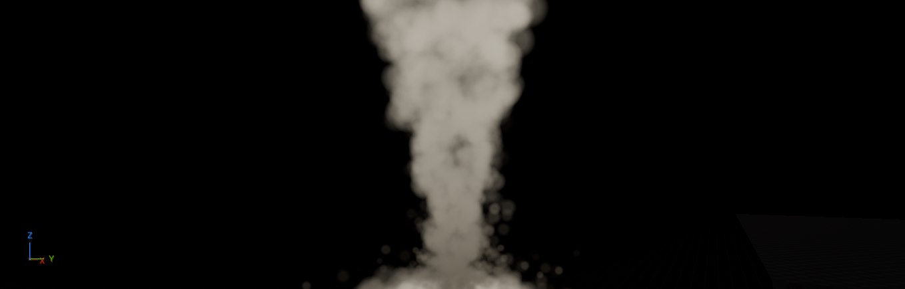</td>
</tr>
<tr>
<td>샷 1 — 오로라 (상공 배치, 전 샷의 하늘 배경)</td>
<td>샷 2 — 토네이도 (로우앵글)</td>
</tr>
</table>

오로라는 상공 z=7000에 배치해 **모든 샷의 하늘 배경**으로 쓰고, 나머지는 서로 화면에 겹치지 않도록 X·Y축에 분산했습니다. 초점거리를 키프레임하지 않으면 시네카메라 기본 35mm가 고정되어 풀백 샷에 아무것도 들어오지 않습니다.

## 6.2 재현

1. `Content/VFX_Test/L_VFX_Showcase` 열기
2. 시퀀서에서 `LS_VFX_Showcase` 재생

## 6.3 기술 노트

<details>
<summary><b>MCP로 막힌 것들 — 4건 (펼치기)</b></summary>

**`set_camera_cut_binding`은 항상 실패합니다.** 어떤 ID 형식을 줘도 `call() takes at most 0 arguments`.
→ **우회**: `ObjectTools.set_properties(section, {"CameraBindingID": {"Guid": <bindingId>, "SequenceID": 0, "ResolveParentIndex": 0}})`로 섹션 프로퍼티를 직접 씁니다.

**시퀀서를 연 채 PIE를 시작하면 죽습니다.** `OnPreBeginPIE → OnPlaybackContextChanged → SpawnRegister::CleanUp → DestroySpawnedObject → AActor::Modify`. 레벨에 남은 스폰 카메라도 `ACineCameraActor::Tick`에서 무효 핸들로 죽습니다.
→ 결과적으로 **시퀀서 카메라 뷰는 스크린샷으로 검증할 수 없습니다.** 나이아가라는 시퀀서 재생만으로 충분히 tick하지 않아 화면이 비고, 파티클을 돌리려면 Simulate가 필요한데 그것이 시퀀서와 공존하지 않습니다. 샷 포즈를 좌표로 직접 캡처해 검증했습니다. 실제 영상은 Movie Render Queue가 답입니다.

**노출을 고정하지 않으면 튜닝이 무의미합니다.** 어두운 씬에서 자동 노출이 열려 additive VFX가 전부 흰색으로 포화됩니다. `AutoExposureMethod: AEM_Manual` + Min=Max=1인 언바운드 PostProcessVolume이 필요합니다.

**거리 컬링은 복구되지 않습니다.** Simulate 중 카메라에서 먼 나이아가라는 컬링되어 꺼지는데, 카메라가 돌아와도 되살아나지 않습니다. 여러 이펙트를 한 세션에서 순회 캡처하면 뒤쪽 것이 조용히 빈 화면으로 나옵니다 — 대상마다 Simulate를 다시 시작해야 합니다. 프레임 단위는 tick이 아닌 **display rate** 기준입니다.

</details>

---

# 7. Control Rig 리깅

> `Content/Characters/CR_Character` · 데모 `Content/Characters/LS_CR_Character_Demo`

3번에서 만든 `SK_Character`는 Blender에서 구운 **베이크드 액션 2종**만 갖고 있었습니다. 여기서는 언리얼 안에서 **애니메이터가 직접 조작할 수 있는 Control Rig**을 MCP로 만들었습니다. 컨트롤 계층·셰이프·색부터 Forward Solve 그래프의 노드 53개와 핀 연결까지 전부 툴 호출이고, 에디터에서 노드를 끌어다 놓은 곳은 없습니다.


## 7.1 결과

| 항목 | 값 |
|---|---|
| 컨트롤 | 28개 (FK 20 · IK 이펙터 4 · 폴벡터 4) |
| Null(오프셋 그룹) | 28개 — 컨트롤마다 1:1 |
| Forward Solve 노드 | 53개 (GetTransform 28 · SetTransform 20 · Basic IK 4 · BeginExecution 1) |
| IK 체인 | 4개 — 양팔(상완→전완→손) · 양다리(허벅지→정강이→발) |
| 대상 본 | 20개 — FK 컨트롤과 1:1 |
| 컨트롤 셰이프 | Circle_Thick(FK) · Box_Thick(IK) · Diamond_Thick(폴벡터) |
| 색 구분 | 중앙 노랑 · 좌 파랑 · 우 빨강 |

## 7.2 컨트롤 구조

컨트롤은 **Null(오프셋) → Control** 쌍으로 쌓았습니다. Null이 본의 rest 트랜스폼을 물고 있어서, 컨트롤의 로컬 값은 rest에서 항등(0,0,0 / scale 1)이 됩니다. 애니메이터가 값을 0으로 되돌리면 정확히 레퍼런스 포즈로 복귀합니다.

```
ctrl_root                              (root 본, 전체 이동)
 └ ctrl_pelvis
    ├ ctrl_spine → ctrl_chest → ctrl_neck → ctrl_head
    │   ├ ctrl_shoulder_L → ctrl_fk_upperarm_L → ctrl_fk_lowerarm_L → ctrl_fk_hand_L
    │   └ ctrl_shoulder_R → ctrl_fk_upperarm_R → ctrl_fk_lowerarm_R → ctrl_fk_hand_R
    ├ ctrl_fk_thigh_L → ctrl_fk_calf_L → ctrl_fk_foot_L
    └ ctrl_fk_thigh_R → ctrl_fk_calf_R → ctrl_fk_foot_R

ctrl_root 직속 (몸통과 독립 — 발이 바닥에 고정되도록)
 ├ ctrl_ik_hand_L / ctrl_ik_hand_R      손 IK 이펙터
 ├ ctrl_ik_foot_L / ctrl_ik_foot_R      발 IK 이펙터
 ├ ctrl_pv_elbow_L / ctrl_pv_elbow_R    팔꿈치 폴벡터 (본 위치에서 -X 60)
 └ ctrl_pv_knee_L / ctrl_pv_knee_R      무릎 폴벡터 (본 위치에서 +X 60)
```

IK 이펙터를 `ctrl_root` 직속에 둔 것이 핵심입니다. 골반이 내려가도 발 컨트롤은 월드에 남아 있고, 그 차이를 IK가 무릎 각도로 흡수합니다.

## 7.3 Forward Solve 그래프

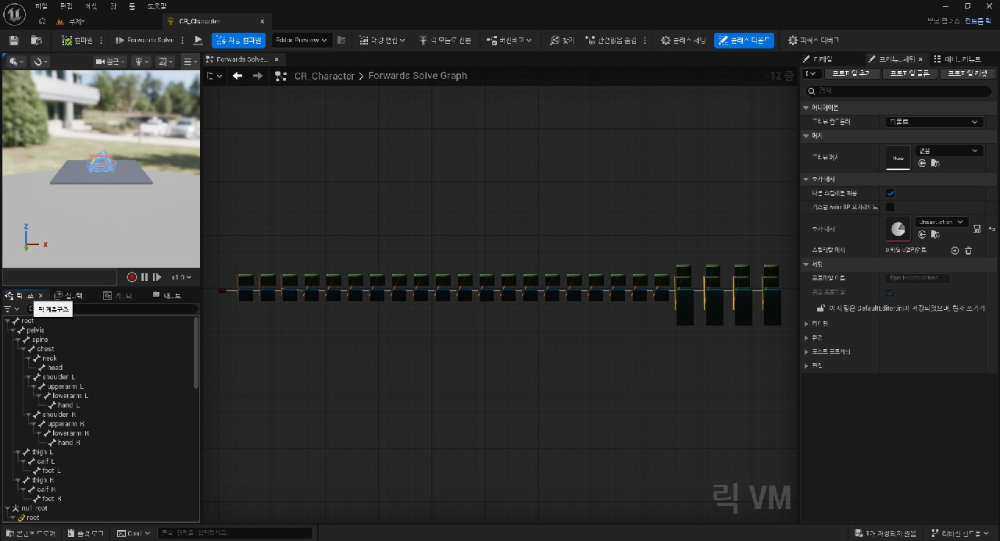

```
BeginExecution
   │
   ├─ FK 20단  GetTransform(ctrl_*, Global) ─→ SetTransform(bone, Global)
   │            부모→자식 순서(root → pelvis → … → foot_R)로 실행 체인 연결
   │
   └─ IK 4단   Basic IK (RigUnit_TwoBoneIKSimplePerItem)
                ItemA/ItemB/EffectorItem  = 상완/전완/손, 허벅지/정강이/발
                Effector    ← GetTransform(ctrl_ik_*).Transform
                PoleVector  ← GetTransform(ctrl_pv_*).Transform.Translation
                PrimaryAxis = (0,-1,0)   ItemALength/BLength = 실측 본 길이
```

`PrimaryAxis`가 `(0,-1,0)`인 것은 이 스켈레톤의 **본 주축이 로컬 −Y**이기 때문입니다. 자식 본의 로컬 위치가 전부 `(0, −n, 0)`으로 나오는 것으로 확인했습니다(Blender 아마추어의 +Y 본 축이 FBX를 거치며 부호가 뒤집힌 결과). 기본값 `(1,0,0)`을 그대로 두면 IK가 팔다리를 엉뚱한 축으로 비틉니다.

본 길이는 rest 글로벌 좌표에서 직접 계산해 핀에 박았습니다 — 상완 32.50 / 전완 26.31 / 허벅지 44.22 / 정강이 38.05.

## 7.4 검증

레벨 시퀀스에 Control Rig 트랙을 붙이고 컨트롤을 실제로 움직여 확인했습니다.

<table>
<tr>
<td width="100%">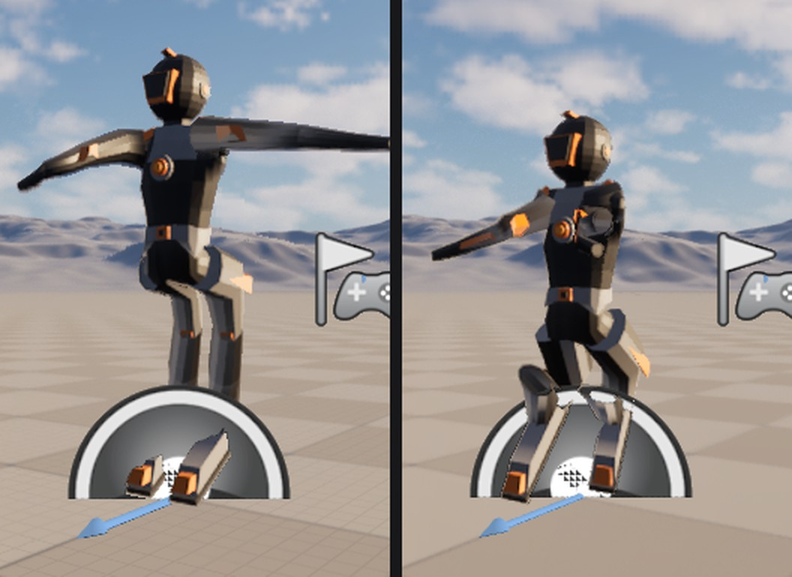</td>
</tr>
<tr>
<td align="center"><b>왼쪽</b> 기본 포즈(컨트롤 전부 0) — <b>오른쪽</b> 골반을 z 94.5→70으로 내리고 손 IK를 앞으로</td>
</tr>
</table>

발 IK 컨트롤은 그대로 둔 채 골반만 내리면 **발은 바닥에 붙은 채 양 무릎이 앞으로 굽습니다.** 폴벡터를 무릎 앞(+X)·팔꿈치 뒤(−X)에 둔 대로 접히는 방향도 맞습니다.

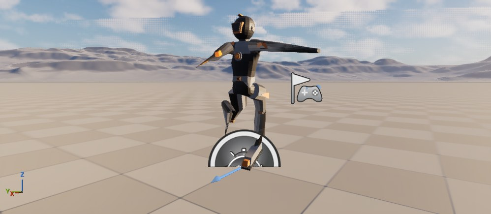

왼쪽 팔다리에만 IK 목표를 준 상태. 오른쪽은 기본 포즈 그대로라 좌우 대조가 분명합니다.

## 7.5 재현

1. `Content/Characters/LS_CR_Character_Demo` 더블클릭 — 캐릭터가 스포너블로 들어 있어 별도 레벨 없이 열립니다
2. 시퀀서 트랙에서 `ctrl_ik_foot_L` 등을 선택해 뷰포트에서 직접 움직여보면 IK가 반응합니다
3. 리그 자체를 보려면 `Content/Characters/CR_Character` 열기 — 릭 계층구조 패널에 본 20 + Null/컨트롤 28이 있습니다
4. 프리뷰 메시는 에셋에 저장되지 않으므로, 리그 에디터에서 보려면 **프리뷰 씬 세팅 → 프리뷰 메시**에 `SK_Character`를 지정하세요 (아래 기술 노트 참고)

## 7.6 기술 노트

<details>
<summary><b>MCP로 막힌 것들 — 6건 (펼치기)</b></summary>

**컨트롤의 초기 스케일이 0으로 들어갑니다.** `add_control`로 `EulerTransform` 컨트롤을 만들면 값이 zero-initialize되어 스케일이 `(0,0,0)`입니다. 이 컨트롤을 부모로 삼아 자식 Null을 글로벌 좌표로 배치하면 부모 역행렬이 특이해져 **자식의 로컬 트랜스폼이 전부 0으로 붕괴합니다.** 컨트롤 28개가 모두 원점에 겹쳐 쌓였습니다.
→ **우회**: `add_control` **직후 곧바로** `set_local_transform`으로 identity(scale 1)를 initial/current 양쪽에 써줍니다. 다음 자식을 만들기 전에 해야 합니다.

**`SK_Character`의 root 본에 스케일 100이 박혀 있습니다.** Blender 임포트 잔재입니다. FK가 컨트롤의 글로벌 트랜스폼을 그대로 본에 쓰는데 컨트롤 스케일이 1이면, root 본 스케일이 100→1이 되어 **캐릭터가 1/100로 쪼그라듭니다.** 뷰포트에서 캐릭터가 사라진 것처럼 보입니다.
→ **우회**: Null을 만들 때 위치·회전뿐 아니라 **본의 글로벌 스케일까지 복사**합니다. 그러면 컨트롤 글로벌 스케일도 100이 되어 FK가 스케일을 보존합니다.

**컨트롤 셰이프 크기는 스케일이 두 번 곱해집니다.** `shapeTransform.scale` × 컨트롤 글로벌 스케일(100) × 셰이프 메시 자체 크기(약 100유닛)입니다. 기본 셰이프 라이브러리의 `DefaultShape`가 scale 0.1을 쓰는 이유가 이것입니다. 처음에 셰이프 스케일을 30으로 줬더니 **컨트롤 하나가 30미터**가 되어 화면을 뒤덮었습니다.
→ **우회**: 원하는 유닛 크기 `S`에 대해 `shapeTransform.scale = S / 10000`. 그리고 셰이프 세팅을 나중에 고치는 툴이 없어서, 크기를 잘못 잡으면 **에셋을 지우고 리그를 다시 만들어야 합니다** — 계층에서 Null/Control을 제거하는 툴 자체가 없습니다(`add_*`만 있고 `remove_*`가 없음).

**`set_world_transform`은 컨트롤 스케일을 리셋합니다.** 월드 스케일을 1로 맞추려고 로컬 스케일을 `1/부모스케일`(=0.01)로 써버립니다. IK 이펙터는 스케일을 안 쓰니 무해하지만, **FK 컨트롤(`ctrl_pelvis` 등)에 쓰면 그 본 이하가 전부 1/100로 붕괴합니다.**
→ **우회**: `set_world_transform`으로 위치를 잡은 뒤 `get_euler_transform`으로 로컬 값을 읽어, 같은 위치·회전에 **scale만 1로 되돌려** `set_euler_transform`을 한 번 더 호출합니다.

**Basic IK가 `Item Lengths are not provided` 경고를 냅니다.** `ItemALength`/`ItemBLength`가 0이면 rest 글로벌 좌표에서 자동 계산하는데, 그 계산에 현재/초기 스케일 비가 곱해집니다. 스케일이 어긋난 상태에서는 길이가 0으로 떨어져 IK가 조용히 놀게 됩니다.
→ **우회**: rest 좌표에서 본 간 거리를 직접 재서 두 핀에 명시적으로 씁니다. 경고가 사라집니다.

**`PreviewSkeletalMesh`는 `ObjectTools`로 쓸 수 없습니다.** ControlRigBlueprint 경로를 넘기면 CDO(`Default__CR_Character_C`)로 리졸브되는데, 프리뷰 메시는 블루프린트 **에셋**의 프로퍼티라 CDO에는 없습니다. `the following properties could not be set: PreviewSkeletalMesh`.
→ **우회**: `SlateInspectorToolset`으로 UI를 직접 조작합니다 — 프리뷰 씬 세팅 탭을 `Click`하고, 프리뷰 메시 행의 콤보박스에 `SelectOption("SK_Character")`. 다만 이 값은 에셋이 아니라 에디터 설정에 저장되므로 리그를 다시 만들면 재지정해야 합니다.

**그 외** — 레벨 뷰포트를 캡처할 때 Control Rig 애님 모드의 컨트롤 기즈모가 화면을 가립니다(카메라가 셰이프 안쪽에 들어가면 내부 면이 통째로 보입니다). `set_anim_mode_hide_manips(true)`로 숨기고 찍으면 됩니다. 그리고 시퀀서에서 컨트롤 값을 바꾼 뒤에는 `set_playhead_frame` + `force_evaluate`를 호출해야 레벨 뷰포트에 반영됩니다.

</details>

---

# 8. 블루프린트 게임플레이

> `Content/HarborGame` · 무대는 1번 항구 레벨

지금까지는 에셋(메시·머티리얼·리그·VFX)만 만들었고 **게임플레이 로직은 없었습니다.** 여기서는 1번에서 지은 항구를 3번 캐릭터로 실제로 걸어다닐 수 있게, 블루프린트를 MCP로 구성했습니다.


## 8.1 결과

| 항목 | 값 |
|---|---|
| `BP_HarborCharacter` | Character 파생 · EventGraph 노드 31개 |
| `BP_HarborGameMode` | GameModeBase 파생 |
| 애니메이션 | BeginPlay에서 `A_Character_Idle` 루프 재생 |
| 입력 | 축 6종(전후·좌우·시점 상하좌우) + 액션 2종(점프·스프린트) |
| 카메라 | 런타임 CameraComponent, 캐릭터 뒤 350 / 위 110 / pitch -8 |
| 이동 | 걷기 450, 스프린트 800, 점프 480 |
| 캡슐 | 반경 34 / 半높이 90 (키 180.8cm에 맞춤) |

## 8.2 구성

블루프린트 CDO의 서브오브젝트에 프로퍼티를 직접 써서 기본 설정을 끝내고, 나머지 로직만 그래프로 만들었습니다.

```
CDO 프로퍼티 (ObjectTools.set_properties)
  Default__BP_HarborCharacter_C:CharacterMesh0     SkeletalMeshAsset=SK_Character, z -90
  Default__BP_HarborCharacter_C:CollisionCylinder  반경 34 / 半높이 90
  Default__BP_HarborCharacter_C:CharMoveComp       MaxWalkSpeed 450, JumpZVelocity 480
  Default__BP_HarborCharacter_C                    bUseControllerRotationYaw=true

EventGraph (create_node + connect_pins)
  BeginPlay ─ AddComponentByClass(SpringArm) ─ Cast ─ Attach(→루트)
            ─ SetTargetArmLength/UsePawnControlRotation
            ─ AddComponentByClass(Camera) ─ Attach(→루트, KeepRelative)
            ─ SetRelativeLocationAndRotation((-350,0,110), pitch -8)
  InputAxis MoveForward  ─ AddMovementInput(GetActorForwardVector, AxisValue)
  InputAxis MoveRight    ─ AddMovementInput(GetActorRightVector,  AxisValue)
  InputAxis LookRight/Up ─ AddControllerYaw/PitchInput(AxisValue)
  InputAction Jump       ─ Pressed→Jump / Released→StopJumping
  InputAction Sprint     ─ Pressed→MaxWalkSpeed 800 / Released→450
            └ PlayAnimation(GetMesh, A_Character_Idle, looping)
```

입력 매핑은 에셋을 만들지 않고 **`InputSettings` CDO에 직접 썼습니다.** `AxisMappings`/`ActionMappings`를 넣으면 에디터 재시작 없이 곧바로 `Input|AxisEvents|MoveForward` 같은 이벤트 노드가 생깁니다. Enhanced Input이 기본값(`DefaultPlayerInputClass=EnhancedPlayerInput`)인데도 레거시 매핑이 그대로 동작합니다.

## 8.3 재현

1. `Content/IndustrialHarbor_Claude/Level/L_IndustrialHarbor_Claude` 열기
2. 레벨에 배치된 `BP_HarborCharacter`(`AutoPossessPlayer=Player0`)가 플레이어입니다 — 그대로 Play
3. **WASD** 이동 · **마우스** 시점 · **Space** 점프 · **LeftShift** 스프린트

## 8.4 남은 것

정직하게 적어두면, 이 섹션은 **아직 덜 끝났습니다.**

- **애님 블루프린트가 없어 이동 애니메이션이 없습니다.** BeginPlay에서 `A_Character_Idle`을 루프 재생시켜 T포즈는 벗어났지만, 걸어도 Idle 그대로입니다. 제대로 하려면 AnimBP + 속도 기반 블렌드스페이스가 필요합니다(`A_Character_Walk`는 이미 있습니다).
- **카메라에 충돌 회피가 없습니다.** 스프링암을 런타임 생성 경로로 붙였을 때 카메라가 팔 끝이 아니라 원점(캐릭터 몸속)에 남아, 결국 카메라를 루트에 직접 상대배치했습니다. 벽에 붙으면 카메라가 벽을 뚫습니다.
- **GameMode의 `DefaultPawnClass`로는 폰이 스폰되지 않았습니다.** 레벨 직접 배치 + `AutoPossessPlayer`로 우회했습니다(아래 기술 노트).

## 8.5 기술 노트

<details>
<summary><b>MCP로 막힌 것들 — 9건 (펼치기)</b></summary>

**`write_graph_dsl`이 한글 에디터에서 반쯤 막힙니다.** 이 툴셋의 하이라이트는 블루프린트 그래프를 S-expression DSL 한 덩어리로 쓰는 `write_graph_dsl`입니다. 그런데 노드 `type_id`가 에디터 언어를 따라 전부 로컬라이즈돼 있고(`Development|PrintString` → `개발|PrintString`, `Transformation|…` → `트랜스포메이션|…`), DSL은 영문 접두사를 하드코딩합니다.
- `(event X …)` → `AddEvent|X`를 찾는데 실제 카테고리는 `이벤트추가|이벤트BeginPlay`. **이벤트를 아예 만들 수 없습니다.**
- `self` 변수 → `Variables|Getareferencetoself does not exist`. self 핀은 **비워두면** 블루프린트가 알아서 self로 취급하므로 `:self self`를 쓰지 않는 것으로 우회했습니다.
- 캐스트의 `(:then …)` continuation → `Unknown exec output "then". Available: []`. 노드를 직접 조회하면 `then`/`CastFailed`가 멀쩡히 있는데도 DSL이 못 읽습니다.
→ **우회**: DSL을 포기하고 `create_node` + `get_node_infos`(핀 조회) + `connect_pins`로 짰습니다. `mk/op/ip/link` 헬퍼를 스크립트에 만들어두면 26노드 정도는 무리 없습니다. 참고로 `read_graph_dsl`도 한글 환경에서는 빈 문자열만 돌려줍니다.

**`(bind x …)`로 exec 노드를 받으면 데이터가 아니라 `then`이 잡힙니다.** DSL이 동작하는 부분에서도 이 함정이 있습니다. `AddComponentByClass`처럼 exec 출력이 먼저인 노드는 **`(bind (execOut value) …)` 튜플 형식**으로 받아야 두 번째가 데이터 출력이 됩니다.

**블루프린트에 컴포넌트를 추가하는 툴이 없습니다.** `PrimitiveTools`는 레벨 액터에 StaticMesh 프리미티브를 붙이는 용도라 SCS(컴포넌트 트리)에는 손을 못 댑니다.
→ **우회**: BeginPlay에서 `Game|클래스로컴포넌트추가`(AddComponentByClass)로 런타임 생성. 단 이 노드는 **자동으로 루트에 붙여주지 않습니다** — `트랜스포메이션|AttachComponentToComponent`를 따로 호출해야 합니다(`self`=붙일 컴포넌트, `Parent`=대상). 처음엔 이걸 빼먹어서 스프링암이 공중에 떠 있었습니다.

**스프링암은 런타임 생성 경로에서 제대로 붙지 않았습니다.** SpringArm을 만들고 카메라를 자식으로 붙여도 카메라가 팔 끝이 아니라 원점(= 캐릭터 몸속)에 남습니다. `SocketName="SpringEndpoint"`를 지정해도 같았습니다.
→ **우회**: 스프링암을 버리고 CameraComponent를 루트에 `KeepRelative`로 붙인 뒤 `SetRelativeLocationAndRotation((-350,0,110), pitch -8)`. 캐릭터에 `bUseControllerRotationYaw=true`를 주면 캐릭터가 컨트롤러 yaw를 따라 돌아 카메라도 뒤를 유지합니다.

**컴파일 에러 "이 블루프린트(셀프)는 SceneComponent 이지 않으므로 'Target'에 연결이 있어야 합니다"** — SceneComponent용 노드에 self(Actor)를 물리려 한 것입니다. `트랜스포메이션|GetForwardVector`는 **SceneComponent**용이고, 액터용은 `트랜스포메이션|GetActorForwardVector`입니다. 이름이 거의 같아서 찾는 데 시간이 걸렸습니다.

**GameMode의 `DefaultPawnClass`로 폰이 스폰되지 않습니다.** WorldSettings에 GameMode를 물려 `LogLoad: Game class is 'BP_HarborGameMode_C'`까지 확인되는데도 캐릭터의 BeginPlay가 돌지 않았습니다(BeginPlay에 심은 PrintString이 로그·화면 어디에도 안 뜸). 스폰 실패 경고조차 남지 않습니다.
→ **우회**: 레벨에 BP를 직접 배치하고 `AutoPossessPlayer="Player0"`. 그 즉시 BeginPlay가 돌았습니다. 원인 규명은 못 했고, PIE 검증은 이 경로로 했습니다.

**`AnimationData`를 채워도 런타임에서는 재생되지 않습니다.** 메시 컴포넌트에 `AnimationMode="AnimationSingleNode"` + `AnimationData.AnimToPlay`를 넣으면 프로퍼티는 멀쩡히 들어가는데(다시 읽으면 그대로 나옵니다) PIE에서는 T포즈 그대로입니다. 그 필드는 에디터 프리뷰용에 가깝습니다.
→ **우회**: BeginPlay에서 `컴포넌트|애니메이션|PlayAnimation`(self=`Variables|캐릭터|GetMesh`, `NewAnimToPlay`, `bLooping=true`)을 직접 호출합니다.

**캡처 툴 두 개가 서로 다른 것을 찍습니다.** `CaptureEditorImage`는 **실제 창**을 캡처해서, 에디터 창이 가려지거나 최소화돼 있으면 `Failed to capture any editor windows`로 실패합니다. 반면 `CaptureViewport`는 렌더 기반이라 창 상태와 무관하지만 **PIE 중에도 에디터 월드를 렌더**합니다 — 그래서 PIE에서 도는 애니메이션은 안 잡히고 캡슐 와이어프레임까지 같이 나옵니다.
→ **우회**: 플레이 화면을 찍으려면 `CaptureEditorImage`를 쓰되, 그 전에 창을 앞으로 가져와야 합니다. Windows `user32.SetForegroundWindow` + `ShowWindow(SW_MAXIMIZE)`를 ctypes로 호출해 창을 띄운 뒤 캡처하면 됩니다.

**MCP 세션이 끊겨도 HTTP로 직접 붙을 수 있습니다.** 이 프로젝트의 언리얼 MCP는 `.mcp.json`에 `{"type":"http","url":"http://127.0.0.1:8000/mcp"}`로 잡혀 있는 HTTP 서버입니다. 클라이언트 쪽 세션이 죽어 툴 목록에서 사라져도, 에디터만 살아 있으면 JSON-RPC를 직접 던져 그대로 작업할 수 있습니다 — `initialize`로 `Mcp-Session-Id`를 받고(이후 요청 헤더에 실어야 합니다), `tools/call`로 `call_tool`을 호출하면 됩니다. 덤으로 캡처 base64가 에이전트 컨텍스트를 거치지 않고 곧장 파일로 떨어져 훨씬 가볍습니다.

</details>
